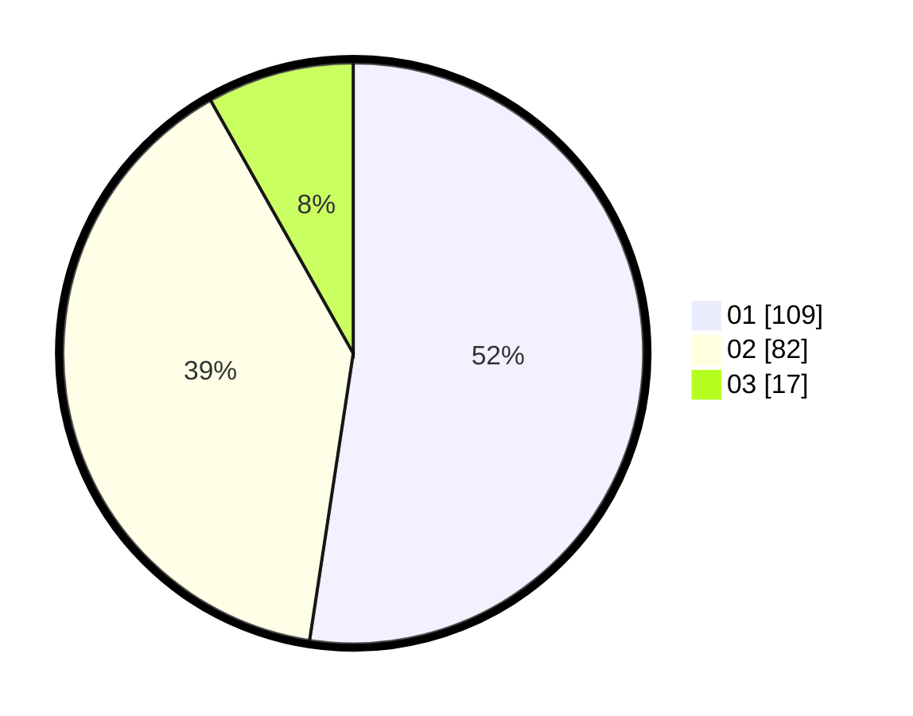

# Hasil

Hasil perolehan suara paslon dapat dilihat pada file paslon-01.txt, paslon-02.txt, dan paslon-03.txt.

Jika tidak ada, artinya data tersebut belum ada pada SIREKAP.

## Perolehan Suara

 * Paslon 01: **109**.
 * Paslon 02: **82**.
 * Paslon 03: **17**.

## Foto C Plano

https://sirekap-obj-formc.kpu.go.id/fded/pemilu/ppwp/31/71/08/10/02/3171081002026-20240214-194204--62ba02a1-a250-4101-b7b3-bda8c66c7332.jpg

https://sirekap-obj-formc.kpu.go.id/fded/pemilu/ppwp/31/71/08/10/02/3171081002026-20240214-194243--21161446-bd1b-4d6f-a961-11274d7857a3.jpg

https://sirekap-obj-formc.kpu.go.id/fded/pemilu/ppwp/31/71/08/10/02/3171081002026-20240214-194338--f2c50c57-7198-453a-be00-1432bb1f4fa0.jpg

## DATA PEMILIH TETAP

Jumlah pemilih dalam DPT: **284**.
 * L: **146**.
 * P: **138**.

## DATA PENGGUNA HAK PILIH

Jumlah pengguna hak pilih dalam DPT: **197**.
 * L: **103**.
 * P: **94**.

Jumlah pengguna hak pilih dalam DPTb: **3**.
 * L: **2**.
 * P: **1**.

Jumlah pengguna hak pilih dalam DPK: **8**.
 * L: **4**.
 * P: **4**.

Jumlah pengguna hak pilih: **208**.
 * L: **109**.
 * P: **99**.

## JUMLAH SUARA SAH DAN TIDAK SAH

JUMLAH SELURUH SUARA SAH: **208**.

JUMLAH SUARA TIDAK SAH: **0**.

JUMLAH SELURUH SUARA SAH DAN SUARA TIDAK SAH: **208**.
