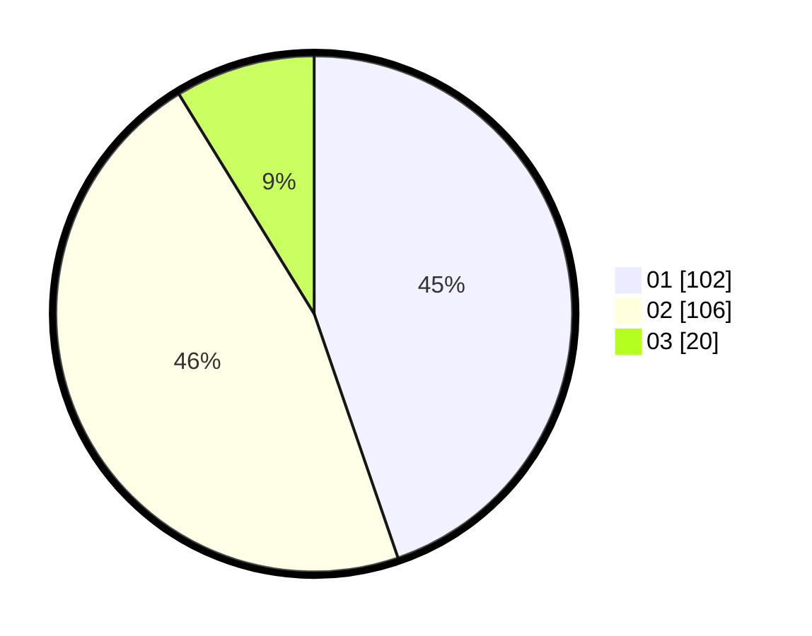

# Hasil

Hasil perolehan suara paslon dapat dilihat pada file paslon-01.txt, paslon-02.txt, dan paslon-03.txt.

Jika tidak ada, artinya data tersebut belum ada pada SIREKAP.

## Perolehan Suara

 * Paslon 01: **102**.
 * Paslon 02: **106**.
 * Paslon 03: **20**.

## Foto C Plano

https://sirekap-obj-formc.kpu.go.id/a45c/pemilu/ppwp/31/71/08/10/02/3171081002028-20240216-144137--879e6057-1b44-4b54-b9ef-f484e3f59485.jpg

https://sirekap-obj-formc.kpu.go.id/a45c/pemilu/ppwp/31/71/08/10/02/3171081002028-20240216-144139--7fb8569c-388e-4c64-bcc4-430fb1ba0fa6.jpg

https://sirekap-obj-formc.kpu.go.id/a45c/pemilu/ppwp/31/71/08/10/02/3171081002028-20240216-111545--2e0ef2b5-59b3-4589-a2b8-b9e52880f161.jpg

## DATA PEMILIH TETAP

Jumlah pemilih dalam DPT: **273**.
 * L: **139**.
 * P: **134**.

## DATA PENGGUNA HAK PILIH

Jumlah pengguna hak pilih dalam DPT: **226**.
 * L: **107**.
 * P: **119**.

Jumlah pengguna hak pilih dalam DPTb: **1**.
 * L: **1**.
 * P: **0**.

Jumlah pengguna hak pilih dalam DPK: **2**.
 * L: **1**.
 * P: **1**.

Jumlah pengguna hak pilih: **229**.
 * L: **109**.
 * P: **120**.

## JUMLAH SUARA SAH DAN TIDAK SAH

JUMLAH SELURUH SUARA SAH: **228**.

JUMLAH SUARA TIDAK SAH: **1**.

JUMLAH SELURUH SUARA SAH DAN SUARA TIDAK SAH: **229**.
