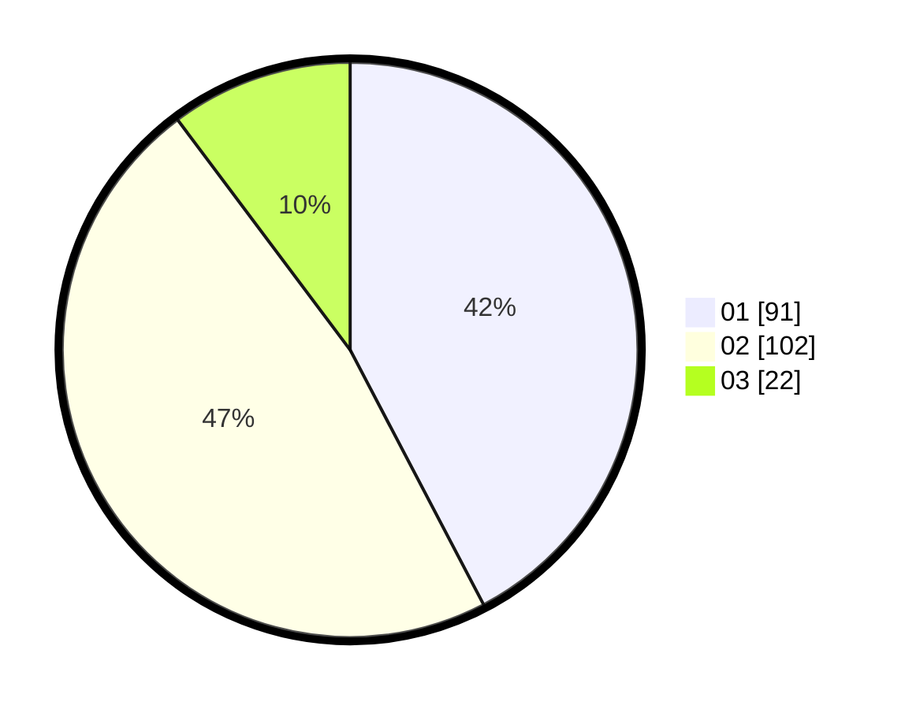

# Hasil

Hasil perolehan suara paslon dapat dilihat pada file paslon-01.txt, paslon-02.txt, dan paslon-03.txt.

Jika tidak ada, artinya data tersebut belum ada pada SIREKAP.

## Perolehan Suara

 * Paslon 01: **91**.
 * Paslon 02: **102**.
 * Paslon 03: **22**.

## Foto C Plano

https://sirekap-obj-formc.kpu.go.id/38bf/pemilu/ppwp/31/71/08/10/02/3171081002029-20240215-221221--f226136b-9a75-40f3-bf1a-c06ad429d138.jpg

https://sirekap-obj-formc.kpu.go.id/38bf/pemilu/ppwp/31/71/08/10/02/3171081002029-20240215-221224--6c6f8bfb-eb36-41cb-bb8b-d83015f89759.jpg

https://sirekap-obj-formc.kpu.go.id/38bf/pemilu/ppwp/31/71/08/10/02/3171081002029-20240215-221223--b439588a-041a-4a3b-9800-c62b4c22c54b.jpg

## DATA PEMILIH TETAP

Jumlah pemilih dalam DPT: **281**.
 * L: **140**.
 * P: **141**.

## DATA PENGGUNA HAK PILIH

Jumlah pengguna hak pilih dalam DPT: **217**.
 * L: **99**.
 * P: **118**.

Jumlah pengguna hak pilih dalam DPTb: **0**.
 * L: **0**.
 * P: **0**.

Jumlah pengguna hak pilih dalam DPK: **0**.
 * L: **0**.
 * P: **0**.

Jumlah pengguna hak pilih: **217**.
 * L: **99**.
 * P: **118**.

## JUMLAH SUARA SAH DAN TIDAK SAH

JUMLAH SELURUH SUARA SAH: **215**.

JUMLAH SUARA TIDAK SAH: **2**.

JUMLAH SELURUH SUARA SAH DAN SUARA TIDAK SAH: **217**.
