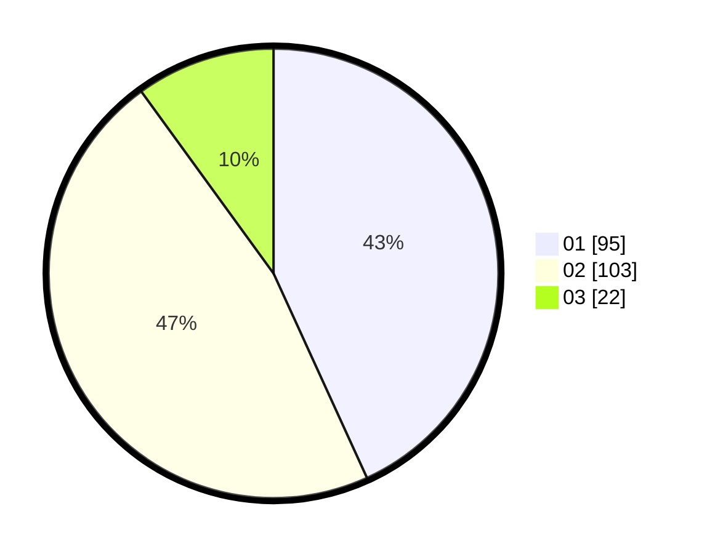

# Hasil

Hasil perolehan suara paslon dapat dilihat pada file paslon-01.txt, paslon-02.txt, dan paslon-03.txt.

Jika tidak ada, artinya data tersebut belum ada pada SIREKAP.

## Perolehan Suara

 * Paslon 01: **95**.
 * Paslon 02: **103**.
 * Paslon 03: **22**.

## Foto C Plano

https://sirekap-obj-formc.kpu.go.id/9cc9/pemilu/ppwp/31/71/08/10/02/3171081002030-20240215-234918--ff513ac0-200d-491c-9fc6-0f2ac31cd7e6.jpg

https://sirekap-obj-formc.kpu.go.id/9cc9/pemilu/ppwp/31/71/08/10/02/3171081002030-20240215-234920--9531e38e-10e4-4938-a60b-91fb2c106cb2.jpg

https://sirekap-obj-formc.kpu.go.id/9cc9/pemilu/ppwp/31/71/08/10/02/3171081002030-20240215-234919--8221271f-7ba0-46b9-8757-1da5f353ca13.jpg

## DATA PEMILIH TETAP

Jumlah pemilih dalam DPT: **275**.
 * L: **149**.
 * P: **126**.

## DATA PENGGUNA HAK PILIH

Jumlah pengguna hak pilih dalam DPT: **222**.
 * L: **116**.
 * P: **106**.

Jumlah pengguna hak pilih dalam DPTb: **0**.
 * L: **0**.
 * P: **0**.

Jumlah pengguna hak pilih dalam DPK: **4**.
 * L: **2**.
 * P: **2**.

Jumlah pengguna hak pilih: **226**.
 * L: **118**.
 * P: **108**.

## JUMLAH SUARA SAH DAN TIDAK SAH

JUMLAH SELURUH SUARA SAH: **220**.

JUMLAH SUARA TIDAK SAH: **6**.

JUMLAH SELURUH SUARA SAH DAN SUARA TIDAK SAH: **226**.
