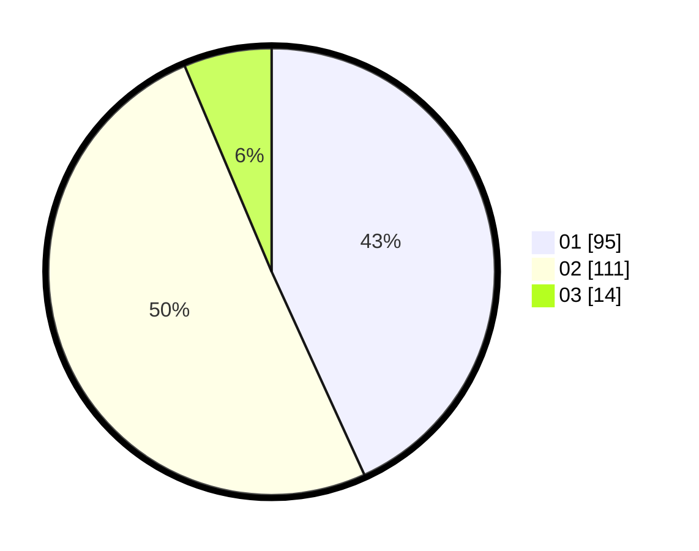

# Hasil

Hasil perolehan suara paslon dapat dilihat pada file paslon-01.txt, paslon-02.txt, dan paslon-03.txt.

Jika tidak ada, artinya data tersebut belum ada pada SIREKAP.

## Perolehan Suara

 * Paslon 01: **95**.
 * Paslon 02: **111**.
 * Paslon 03: **14**.

## Foto C Plano

https://sirekap-obj-formc.kpu.go.id/ffe2/pemilu/ppwp/31/71/08/10/02/3171081002031-20240216-120545--8e8ed5a0-99e5-4311-93fd-eb81c52af3e5.jpg

https://sirekap-obj-formc.kpu.go.id/ffe2/pemilu/ppwp/31/71/08/10/02/3171081002031-20240216-120547--c13e72c5-905b-4c23-bfd1-976f0328995b.jpg

https://sirekap-obj-formc.kpu.go.id/ffe2/pemilu/ppwp/31/71/08/10/02/3171081002031-20240216-120546--76852250-a021-4c94-921d-9ae0ce48d81b.jpg

## DATA PEMILIH TETAP

Jumlah pemilih dalam DPT: **282**.
 * L: **147**.
 * P: **135**.

## DATA PENGGUNA HAK PILIH

Jumlah pengguna hak pilih dalam DPT: **221**.
 * L: **112**.
 * P: **109**.

Jumlah pengguna hak pilih dalam DPTb: **1**.
 * L: **1**.
 * P: **0**.

Jumlah pengguna hak pilih dalam DPK: **3**.
 * L: **1**.
 * P: **2**.

Jumlah pengguna hak pilih: **225**.
 * L: **114**.
 * P: **111**.

## JUMLAH SUARA SAH DAN TIDAK SAH

JUMLAH SELURUH SUARA SAH: **220**.

JUMLAH SUARA TIDAK SAH: **6**.

JUMLAH SELURUH SUARA SAH DAN SUARA TIDAK SAH: **226**.
