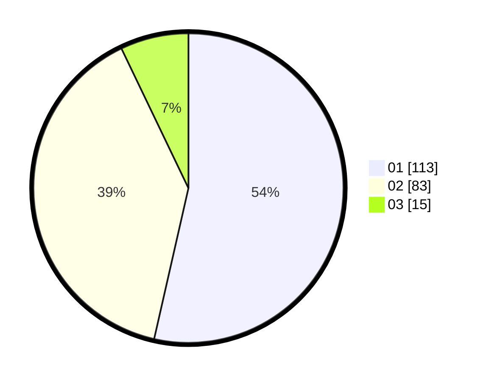

# Hasil

Hasil perolehan suara paslon dapat dilihat pada file paslon-01.txt, paslon-02.txt, dan paslon-03.txt.

Jika tidak ada, artinya data tersebut belum ada pada SIREKAP.

## Perolehan Suara

 * Paslon 01: **113**.
 * Paslon 02: **83**.
 * Paslon 03: **15**.

## Foto C Plano

https://sirekap-obj-formc.kpu.go.id/9be3/pemilu/ppwp/31/71/08/10/02/3171081002032-20240214-162222--b031420f-c00e-473d-88c9-b64ca6aa4543.jpg

https://sirekap-obj-formc.kpu.go.id/9be3/pemilu/ppwp/31/71/08/10/02/3171081002032-20240214-155703--e5660031-765d-417f-a22b-fc7ce3318d39.jpg
