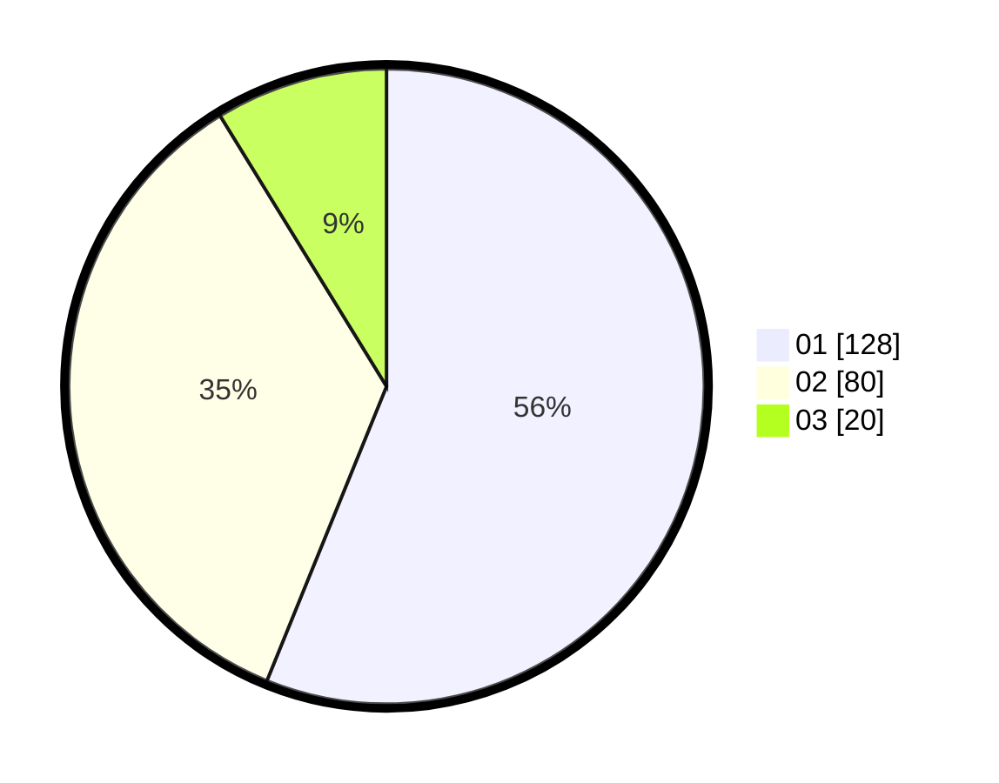

# Hasil

Hasil perolehan suara paslon dapat dilihat pada file paslon-01.txt, paslon-02.txt, dan paslon-03.txt.

Jika tidak ada, artinya data tersebut belum ada pada SIREKAP.

## Perolehan Suara

 * Paslon 01: **128**.
 * Paslon 02: **80**.
 * Paslon 03: **20**.

## Foto C Plano

https://sirekap-obj-formc.kpu.go.id/8908/pemilu/ppwp/31/71/08/10/02/3171081002040-20240217-141112--d969f72e-dc92-4bad-b572-dd789c679dc3.jpg

https://sirekap-obj-formc.kpu.go.id/8908/pemilu/ppwp/31/71/08/10/02/3171081002040-20240214-230024--5ec035d8-ed3b-4ed7-821d-2c148ea4937d.jpg

https://sirekap-obj-formc.kpu.go.id/8908/pemilu/ppwp/31/71/08/10/02/3171081002040-20240214-230916--3ca04bbc-7107-4193-896b-5b5f8ef86900.jpg
