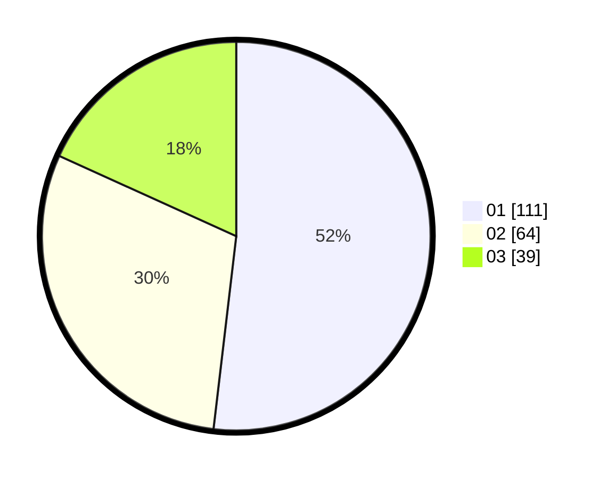

# Hasil

Hasil perolehan suara paslon dapat dilihat pada file paslon-01.txt, paslon-02.txt, dan paslon-03.txt.

Jika tidak ada, artinya data tersebut belum ada pada SIREKAP.

## Perolehan Suara

 * Paslon 01: **111**.
 * Paslon 02: **64**.
 * Paslon 03: **39**.

## Foto C Plano

https://sirekap-obj-formc.kpu.go.id/14a6/pemilu/ppwp/31/71/08/10/02/3171081002042-20240216-100040--a448140b-93ec-41ec-a9df-eb42835cdbd6.jpg

https://sirekap-obj-formc.kpu.go.id/14a6/pemilu/ppwp/31/71/08/10/02/3171081002042-20240216-170619--fcbf0ee7-b260-4fdc-977e-dd5548e3a948.jpg
