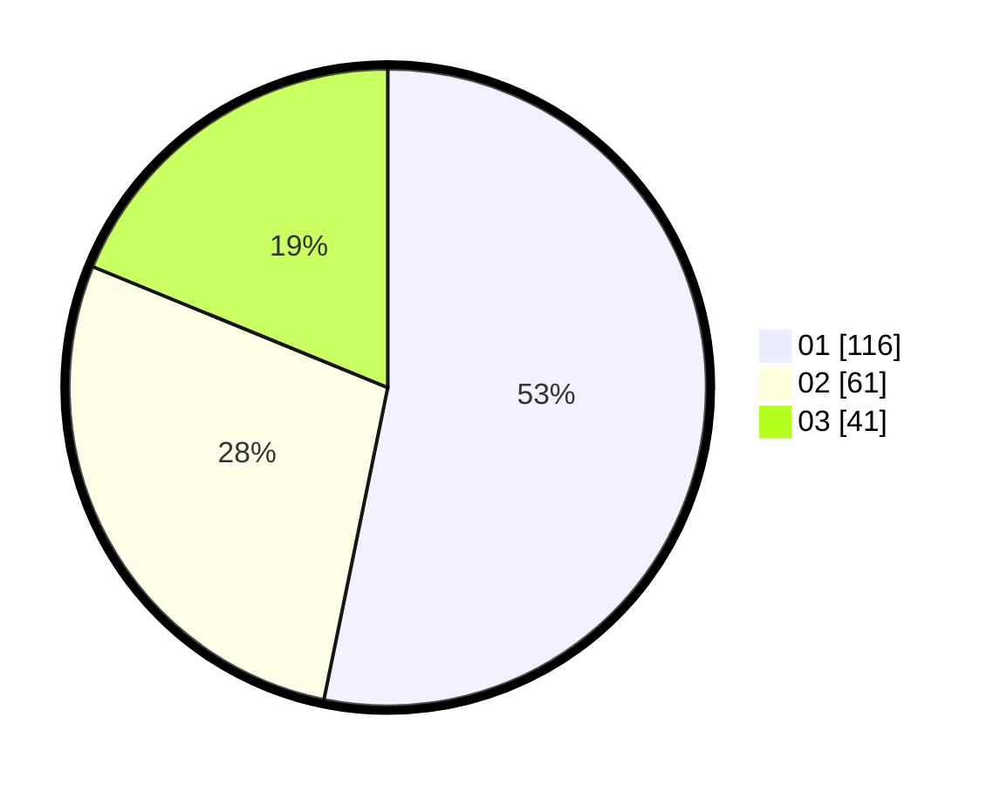

# Hasil

Hasil perolehan suara paslon dapat dilihat pada file paslon-01.txt, paslon-02.txt, dan paslon-03.txt.

Jika tidak ada, artinya data tersebut belum ada pada SIREKAP.

## Perolehan Suara

 * Paslon 01: **116**.
 * Paslon 02: **61**.
 * Paslon 03: **41**.

## Foto C Plano

https://sirekap-obj-formc.kpu.go.id/7bc3/pemilu/ppwp/31/71/08/10/02/3171081002043-20240216-141515--da43b43d-0fa9-405d-a90d-89f8b2b882ec.jpg

https://sirekap-obj-formc.kpu.go.id/7bc3/pemilu/ppwp/31/71/08/10/02/3171081002043-20240216-141517--a64b5a57-f34a-426e-a72f-f5a5c3cc0af3.jpg

https://sirekap-obj-formc.kpu.go.id/7bc3/pemilu/ppwp/31/71/08/10/02/3171081002043-20240216-141516--b0809cb4-092e-4946-ac84-4cbe639d9e4d.jpg

## DATA PEMILIH TETAP

Jumlah pemilih dalam DPT: **0**.
 * L: **0**.
 * P: **0**.

## DATA PENGGUNA HAK PILIH

Jumlah pengguna hak pilih dalam DPT: **0**.
 * L: **0**.
 * P: **0**.

Jumlah pengguna hak pilih dalam DPTb: **0**.
 * L: **0**.
 * P: **0**.

Jumlah pengguna hak pilih dalam DPK: **0**.
 * L: **0**.
 * P: **0**.

Jumlah pengguna hak pilih: **0**.
 * L: **0**.
 * P: **0**.

## JUMLAH SUARA SAH DAN TIDAK SAH

JUMLAH SELURUH SUARA SAH: **218**.

JUMLAH SUARA TIDAK SAH: **2**.

JUMLAH SELURUH SUARA SAH DAN SUARA TIDAK SAH: **220**.
