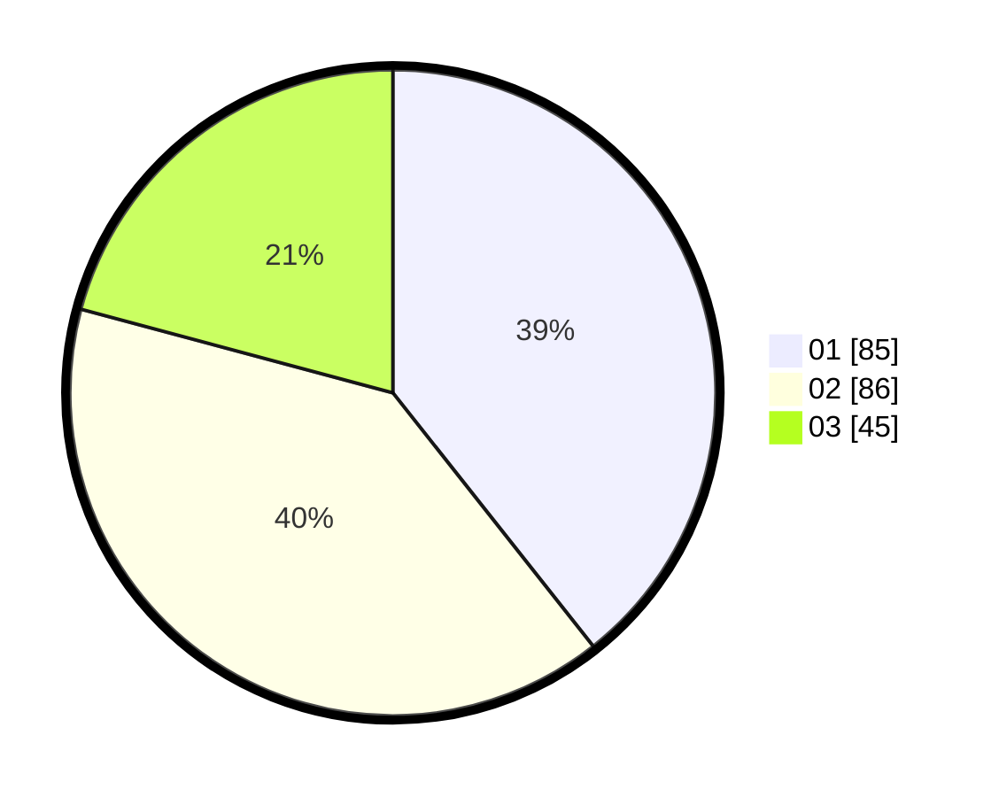

# Hasil

Hasil perolehan suara paslon dapat dilihat pada file paslon-01.txt, paslon-02.txt, dan paslon-03.txt.

Jika tidak ada, artinya data tersebut belum ada pada SIREKAP.

## Perolehan Suara

 * Paslon 01: **85**.
 * Paslon 02: **86**.
 * Paslon 03: **45**.

## Foto C Plano

https://sirekap-obj-formc.kpu.go.id/b06c/pemilu/ppwp/31/71/08/10/02/3171081002044-20240216-145905--26d08fc4-c1ed-4937-8916-bdc31053baee.jpg

https://sirekap-obj-formc.kpu.go.id/b06c/pemilu/ppwp/31/71/08/10/02/3171081002044-20240215-131036--322ba767-e6dd-475b-9c60-4275f9cfb42f.jpg

https://sirekap-obj-formc.kpu.go.id/b06c/pemilu/ppwp/31/71/08/10/02/3171081002044-20240216-121837--4c1403ca-fd1b-48b4-b33e-1d814349dbbd.jpg

## DATA PEMILIH TETAP

Jumlah pemilih dalam DPT: **274**.
 * L: **126**.
 * P: **148**.

## DATA PENGGUNA HAK PILIH

Jumlah pengguna hak pilih dalam DPT: **217**.
 * L: **92**.
 * P: **125**.

Jumlah pengguna hak pilih dalam DPTb: **0**.
 * L: **0**.
 * P: **0**.

Jumlah pengguna hak pilih dalam DPK: **1**.
 * L: **0**.
 * P: **1**.

Jumlah pengguna hak pilih: **218**.
 * L: **92**.
 * P: **126**.

## JUMLAH SUARA SAH DAN TIDAK SAH

JUMLAH SELURUH SUARA SAH: **216**.

JUMLAH SUARA TIDAK SAH: **2**.

JUMLAH SELURUH SUARA SAH DAN SUARA TIDAK SAH: **218**.
