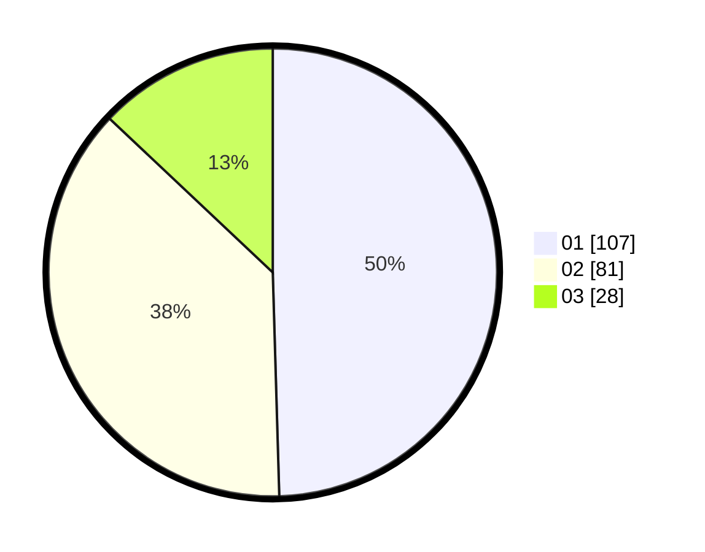

# Hasil

Hasil perolehan suara paslon dapat dilihat pada file paslon-01.txt, paslon-02.txt, dan paslon-03.txt.

Jika tidak ada, artinya data tersebut belum ada pada SIREKAP.

## Perolehan Suara

 * Paslon 01: **107**.
 * Paslon 02: **81**.
 * Paslon 03: **28**.

## Foto C Plano

https://sirekap-obj-formc.kpu.go.id/768a/pemilu/ppwp/31/71/08/10/02/3171081002046-20240217-195142--89403540-7d29-4c1f-98ff-37b45968adb5.jpg

https://sirekap-obj-formc.kpu.go.id/768a/pemilu/ppwp/31/71/08/10/02/3171081002046-20240217-195712--66b6fc66-8d9a-4f1a-b3cd-d81a0ac426f8.jpg

https://sirekap-obj-formc.kpu.go.id/768a/pemilu/ppwp/31/71/08/10/02/3171081002046-20240217-195833--833cc5dd-613f-4a56-8888-da87e048669c.jpg

## DATA PEMILIH TETAP

Jumlah pemilih dalam DPT: **265**.
 * L: **127**.
 * P: **138**.

## DATA PENGGUNA HAK PILIH

Jumlah pengguna hak pilih dalam DPT: **213**.
 * L: **95**.
 * P: **118**.

Jumlah pengguna hak pilih dalam DPTb: **1**.
 * L: **1**.
 * P: **0**.

Jumlah pengguna hak pilih dalam DPK: **5**.
 * L: **3**.
 * P: **2**.

Jumlah pengguna hak pilih: **219**.
 * L: **99**.
 * P: **120**.

## JUMLAH SUARA SAH DAN TIDAK SAH

JUMLAH SELURUH SUARA SAH: **216**.

JUMLAH SUARA TIDAK SAH: **3**.

JUMLAH SELURUH SUARA SAH DAN SUARA TIDAK SAH: **219**.
