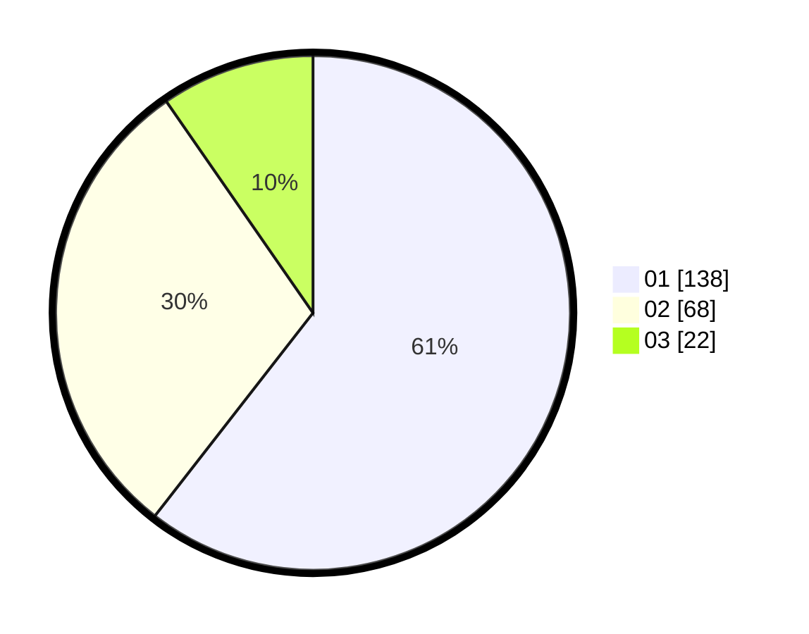

# Hasil

Hasil perolehan suara paslon dapat dilihat pada file paslon-01.txt, paslon-02.txt, dan paslon-03.txt.

Jika tidak ada, artinya data tersebut belum ada pada SIREKAP.

## Perolehan Suara

 * Paslon 01: **138**.
 * Paslon 02: **68**.
 * Paslon 03: **22**.

## Foto C Plano

https://sirekap-obj-formc.kpu.go.id/3657/pemilu/ppwp/31/71/08/10/02/3171081002048-20240214-211231--fe762249-9be4-4c4c-b909-3ac05a09e92d.jpg

https://sirekap-obj-formc.kpu.go.id/3657/pemilu/ppwp/31/71/08/10/02/3171081002048-20240214-211638--c77fcc5a-49bd-467d-aecc-a9cc945c654f.jpg

https://sirekap-obj-formc.kpu.go.id/3657/pemilu/ppwp/31/71/08/10/02/3171081002048-20240214-211126--b788d5c2-35ab-43ac-a422-738576bd4899.jpg
