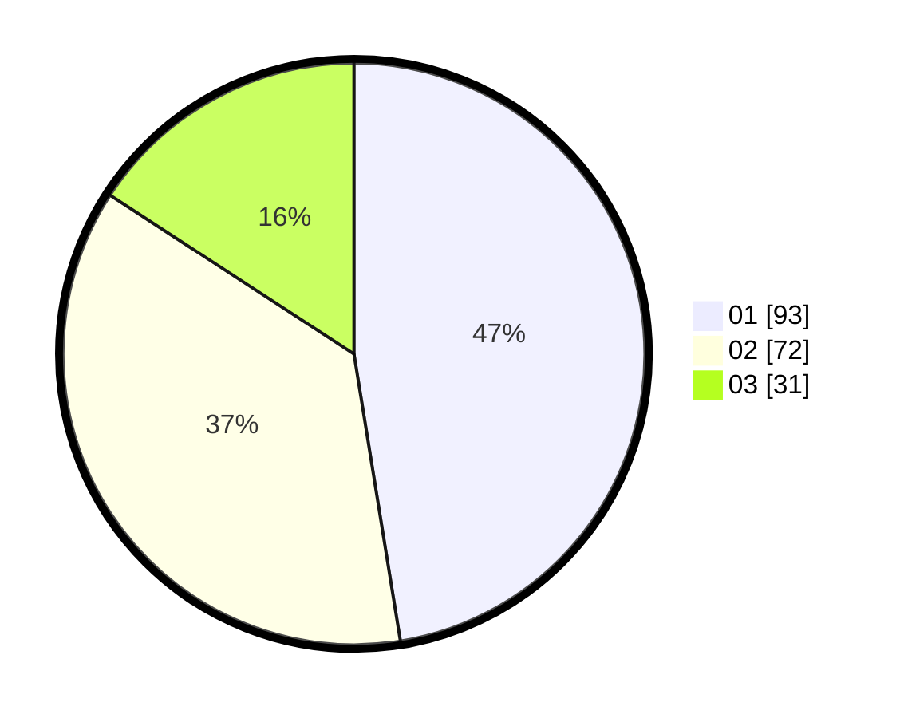

# Hasil

Hasil perolehan suara paslon dapat dilihat pada file paslon-01.txt, paslon-02.txt, dan paslon-03.txt.

Jika tidak ada, artinya data tersebut belum ada pada SIREKAP.

## Perolehan Suara

 * Paslon 01: **93**.
 * Paslon 02: **72**.
 * Paslon 03: **31**.

## Foto C Plano

https://sirekap-obj-formc.kpu.go.id/1b5e/pemilu/ppwp/31/71/08/10/02/3171081002049-20240214-194943--d98aa7ff-0798-472f-85dd-441d1e68c9be.jpg

https://sirekap-obj-formc.kpu.go.id/1b5e/pemilu/ppwp/31/71/08/10/02/3171081002049-20240214-195002--486a0259-f8f3-4048-9a4e-04c61ce360ac.jpg

https://sirekap-obj-formc.kpu.go.id/1b5e/pemilu/ppwp/31/71/08/10/02/3171081002049-20240214-195016--7116362d-9861-44ec-b9de-ae718113c9f4.jpg

## DATA PEMILIH TETAP

Jumlah pemilih dalam DPT: **266**.
 * L: **121**.
 * P: **145**.

## DATA PENGGUNA HAK PILIH

Jumlah pengguna hak pilih dalam DPT: **199**.
 * L: **91**.
 * P: **108**.

Jumlah pengguna hak pilih dalam DPTb: **2**.
 * L: **1**.
 * P: **1**.

Jumlah pengguna hak pilih dalam DPK: **0**.
 * L: **0**.
 * P: **0**.

Jumlah pengguna hak pilih: **201**.
 * L: **92**.
 * P: **109**.

## JUMLAH SUARA SAH DAN TIDAK SAH

JUMLAH SELURUH SUARA SAH: **196**.

JUMLAH SUARA TIDAK SAH: **5**.

JUMLAH SELURUH SUARA SAH DAN SUARA TIDAK SAH: **201**.
