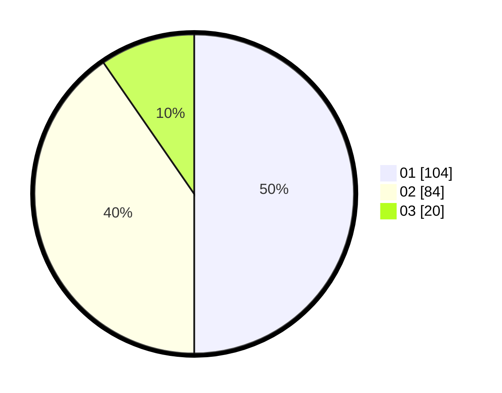

# Hasil

Hasil perolehan suara paslon dapat dilihat pada file paslon-01.txt, paslon-02.txt, dan paslon-03.txt.

Jika tidak ada, artinya data tersebut belum ada pada SIREKAP.

## Perolehan Suara

 * Paslon 01: **104**.
 * Paslon 02: **84**.
 * Paslon 03: **20**.

## Foto C Plano

https://sirekap-obj-formc.kpu.go.id/c46a/pemilu/ppwp/31/71/08/10/02/3171081002050-20240216-150109--bae53fef-5f7a-4e55-adc7-23eb6d86d501.jpg

https://sirekap-obj-formc.kpu.go.id/c46a/pemilu/ppwp/31/71/08/10/02/3171081002050-20240216-150110--3ca70a88-0ebc-4878-b1e0-5e0e5fd73627.jpg

https://sirekap-obj-formc.kpu.go.id/c46a/pemilu/ppwp/31/71/08/10/02/3171081002050-20240216-150110--d70423aa-e5a6-4f43-ba62-270d5e772285.jpg

## DATA PEMILIH TETAP

Jumlah pemilih dalam DPT: **271**.
 * L: **148**.
 * P: **123**.

## DATA PENGGUNA HAK PILIH

Jumlah pengguna hak pilih dalam DPT: **206**.
 * L: **106**.
 * P: **100**.

Jumlah pengguna hak pilih dalam DPTb: **2**.
 * L: **2**.
 * P: **0**.

Jumlah pengguna hak pilih dalam DPK: **0**.
 * L: **0**.
 * P: **0**.

Jumlah pengguna hak pilih: **208**.
 * L: **108**.
 * P: **100**.

## JUMLAH SUARA SAH DAN TIDAK SAH

JUMLAH SELURUH SUARA SAH: **208**.

JUMLAH SUARA TIDAK SAH: **0**.

JUMLAH SELURUH SUARA SAH DAN SUARA TIDAK SAH: **208**.
