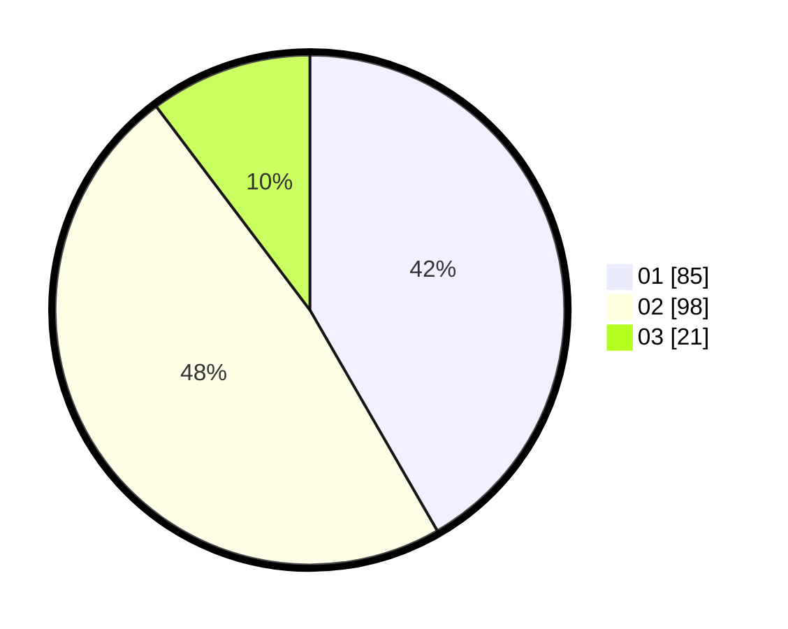

# Hasil

Hasil perolehan suara paslon dapat dilihat pada file paslon-01.txt, paslon-02.txt, dan paslon-03.txt.

Jika tidak ada, artinya data tersebut belum ada pada SIREKAP.

## Perolehan Suara

 * Paslon 01: **85**.
 * Paslon 02: **98**.
 * Paslon 03: **21**.

## Foto C Plano

https://sirekap-obj-formc.kpu.go.id/8f34/pemilu/ppwp/31/71/08/10/02/3171081002051-20240217-223745--9f9bc0a9-b158-4797-b83b-476498bde6dc.jpg

https://sirekap-obj-formc.kpu.go.id/8f34/pemilu/ppwp/31/71/08/10/02/3171081002051-20240217-223746--df4a3c08-861e-488f-b261-0f775efdcc92.jpg

https://sirekap-obj-formc.kpu.go.id/8f34/pemilu/ppwp/31/71/08/10/02/3171081002051-20240217-223746--02065922-e21f-4b29-8644-01fdf00b1c7c.jpg

## DATA PEMILIH TETAP

Jumlah pemilih dalam DPT: **273**.
 * L: **134**.
 * P: **139**.

## DATA PENGGUNA HAK PILIH

Jumlah pengguna hak pilih dalam DPT: **208**.
 * L: **102**.
 * P: **106**.

Jumlah pengguna hak pilih dalam DPTb: **0**.
 * L: **0**.
 * P: **0**.

Jumlah pengguna hak pilih dalam DPK: **2**.
 * L: **1**.
 * P: **1**.

Jumlah pengguna hak pilih: **210**.
 * L: **103**.
 * P: **107**.

## JUMLAH SUARA SAH DAN TIDAK SAH

JUMLAH SELURUH SUARA SAH: **204**.

JUMLAH SUARA TIDAK SAH: **6**.

JUMLAH SELURUH SUARA SAH DAN SUARA TIDAK SAH: **210**.
