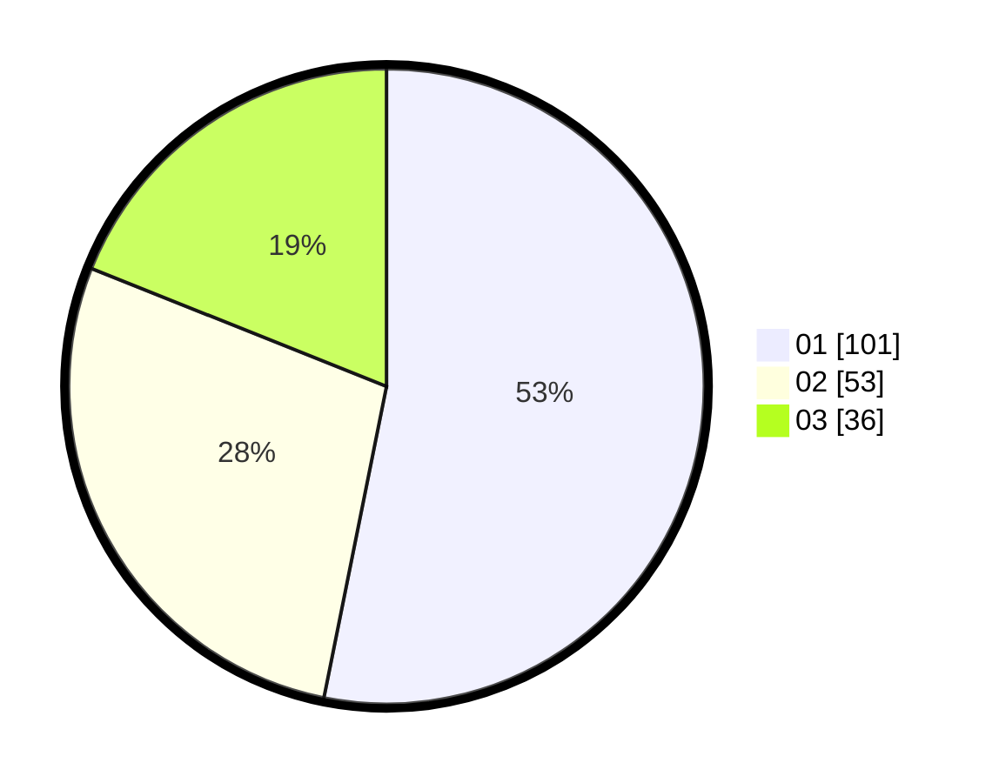

# Hasil

Hasil perolehan suara paslon dapat dilihat pada file paslon-01.txt, paslon-02.txt, dan paslon-03.txt.

Jika tidak ada, artinya data tersebut belum ada pada SIREKAP.

## Perolehan Suara

 * Paslon 01: **101**.
 * Paslon 02: **53**.
 * Paslon 03: **36**.

## Foto C Plano

https://sirekap-obj-formc.kpu.go.id/9420/pemilu/ppwp/31/71/08/10/02/3171081002059-20240215-002455--06fb4ea4-998c-4118-86dd-63d6272a4ecc.jpg

https://sirekap-obj-formc.kpu.go.id/9420/pemilu/ppwp/31/71/08/10/02/3171081002059-20240216-140948--c4f630f3-cfc1-4050-8be0-ce9a8fd5d885.jpg

https://sirekap-obj-formc.kpu.go.id/9420/pemilu/ppwp/31/71/08/10/02/3171081002059-20240216-140947--46b093ac-44f1-4b4b-9c76-de085ae76110.jpg

## DATA PEMILIH TETAP

Jumlah pemilih dalam DPT: **261**.
 * L: **127**.
 * P: **134**.

## DATA PENGGUNA HAK PILIH

Jumlah pengguna hak pilih dalam DPT: **196**.
 * L: **96**.
 * P: **100**.

Jumlah pengguna hak pilih dalam DPTb: **7**.
 * L: **1**.
 * P: **6**.

Jumlah pengguna hak pilih dalam DPK: **1**.
 * L: **0**.
 * P: **1**.

Jumlah pengguna hak pilih: **204**.
 * L: **97**.
 * P: **107**.

## JUMLAH SUARA SAH DAN TIDAK SAH

JUMLAH SELURUH SUARA SAH: **200**.

JUMLAH SUARA TIDAK SAH: **4**.

JUMLAH SELURUH SUARA SAH DAN SUARA TIDAK SAH: **204**.
