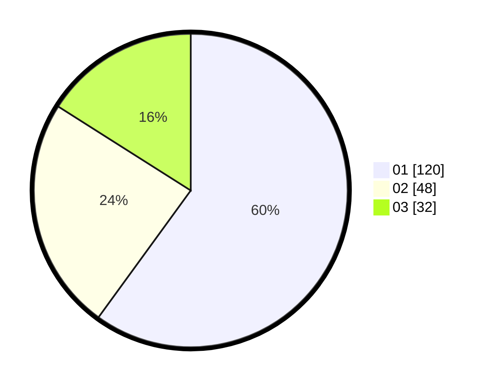

# Hasil

Hasil perolehan suara paslon dapat dilihat pada file paslon-01.txt, paslon-02.txt, dan paslon-03.txt.

Jika tidak ada, artinya data tersebut belum ada pada SIREKAP.

## Perolehan Suara

 * Paslon 01: **120**.
 * Paslon 02: **48**.
 * Paslon 03: **32**.

## Foto C Plano

https://sirekap-obj-formc.kpu.go.id/923a/pemilu/ppwp/31/71/08/10/02/3171081002061-20240216-150151--d696957b-02c8-4a9d-987d-dfc7b1c50cbf.jpg

https://sirekap-obj-formc.kpu.go.id/923a/pemilu/ppwp/31/71/08/10/02/3171081002061-20240216-150152--df1ba56a-06c2-488d-990a-09c617565ca2.jpg

https://sirekap-obj-formc.kpu.go.id/923a/pemilu/ppwp/31/71/08/10/02/3171081002061-20240216-145947--ee02c3fe-5320-4029-8643-2e20d53d2572.jpg

## DATA PEMILIH TETAP

Jumlah pemilih dalam DPT: **259**.
 * L: **130**.
 * P: **129**.

## DATA PENGGUNA HAK PILIH

Jumlah pengguna hak pilih dalam DPT: **200**.
 * L: **99**.
 * P: **101**.

Jumlah pengguna hak pilih dalam DPTb: **0**.
 * L: **0**.
 * P: **0**.

Jumlah pengguna hak pilih dalam DPK: **3**.
 * L: **1**.
 * P: **2**.

Jumlah pengguna hak pilih: **203**.
 * L: **100**.
 * P: **103**.

## JUMLAH SUARA SAH DAN TIDAK SAH

JUMLAH SELURUH SUARA SAH: **200**.

JUMLAH SUARA TIDAK SAH: **3**.

JUMLAH SELURUH SUARA SAH DAN SUARA TIDAK SAH: **203**.
