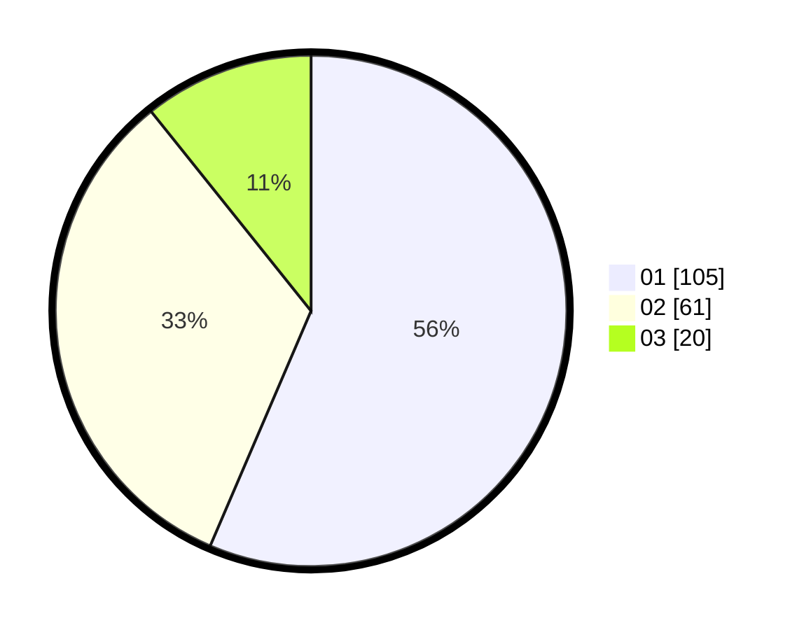

# Hasil

Hasil perolehan suara paslon dapat dilihat pada file paslon-01.txt, paslon-02.txt, dan paslon-03.txt.

Jika tidak ada, artinya data tersebut belum ada pada SIREKAP.

## Perolehan Suara

 * Paslon 01: **105**.
 * Paslon 02: **61**.
 * Paslon 03: **20**.

## Foto C Plano

https://sirekap-obj-formc.kpu.go.id/ca30/pemilu/ppwp/31/71/08/10/02/3171081002062-20240214-225415--4d766c76-c8f9-4631-a541-f28708100640.jpg

https://sirekap-obj-formc.kpu.go.id/ca30/pemilu/ppwp/31/71/08/10/02/3171081002062-20240214-215929--636c21cb-ee94-48bd-b6ec-c0818932b01e.jpg

https://sirekap-obj-formc.kpu.go.id/ca30/pemilu/ppwp/31/71/08/10/02/3171081002062-20240214-211537--85c4d0eb-96b4-413a-af95-a0d14e9c6991.jpg

## DATA PEMILIH TETAP

Jumlah pemilih dalam DPT: **252**.
 * L: **136**.
 * P: **116**.

## DATA PENGGUNA HAK PILIH

Jumlah pengguna hak pilih dalam DPT: **187**.
 * L: **99**.
 * P: **88**.

Jumlah pengguna hak pilih dalam DPTb: **3**.
 * L: **1**.
 * P: **2**.

Jumlah pengguna hak pilih dalam DPK: **0**.
 * L: **0**.
 * P: **0**.

Jumlah pengguna hak pilih: **190**.
 * L: **100**.
 * P: **90**.

## JUMLAH SUARA SAH DAN TIDAK SAH

JUMLAH SELURUH SUARA SAH: **186**.

JUMLAH SUARA TIDAK SAH: **4**.

JUMLAH SELURUH SUARA SAH DAN SUARA TIDAK SAH: **190**.
