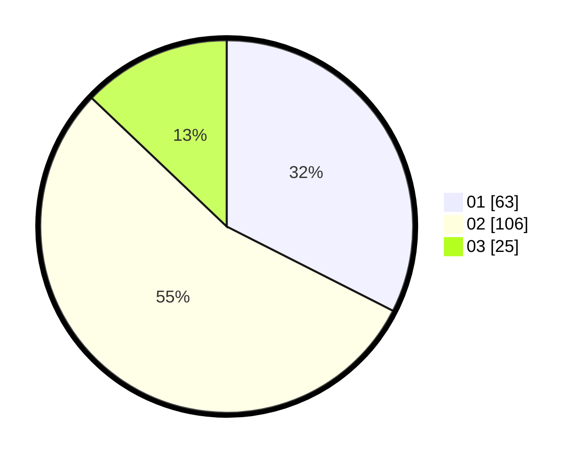

# Hasil

Hasil perolehan suara paslon dapat dilihat pada file paslon-01.txt, paslon-02.txt, dan paslon-03.txt.

Jika tidak ada, artinya data tersebut belum ada pada SIREKAP.

## Perolehan Suara

 * Paslon 01: **63**.
 * Paslon 02: **106**.
 * Paslon 03: **25**.

## Foto C Plano

https://sirekap-obj-formc.kpu.go.id/7686/pemilu/ppwp/31/71/08/10/02/3171081002070-20240215-212054--294228f0-f113-4992-9c5e-9c0a9cd5df69.jpg

https://sirekap-obj-formc.kpu.go.id/7686/pemilu/ppwp/31/71/08/10/02/3171081002070-20240215-212055--699238fe-7f46-4fbd-bcf6-2ae0569748d4.jpg

https://sirekap-obj-formc.kpu.go.id/7686/pemilu/ppwp/31/71/08/10/02/3171081002070-20240215-212054--635fc811-1ed0-41a4-b228-8822f9774423.jpg

## DATA PEMILIH TETAP

Jumlah pemilih dalam DPT: **199**.
 * L: **97**.
 * P: **102**.

## DATA PENGGUNA HAK PILIH

Jumlah pengguna hak pilih dalam DPT: **268**.
 * L: **138**.
 * P: **130**.

Jumlah pengguna hak pilih dalam DPTb: **6**.
 * L: **4**.
 * P: **2**.

Jumlah pengguna hak pilih dalam DPK: **1**.
 * L: **1**.
 * P: **0**.

Jumlah pengguna hak pilih: **275**.
 * L: **381**.
 * P: **130**.

## JUMLAH SUARA SAH DAN TIDAK SAH

JUMLAH SELURUH SUARA SAH: **194**.

JUMLAH SUARA TIDAK SAH: **5**.

JUMLAH SELURUH SUARA SAH DAN SUARA TIDAK SAH: **199**.
