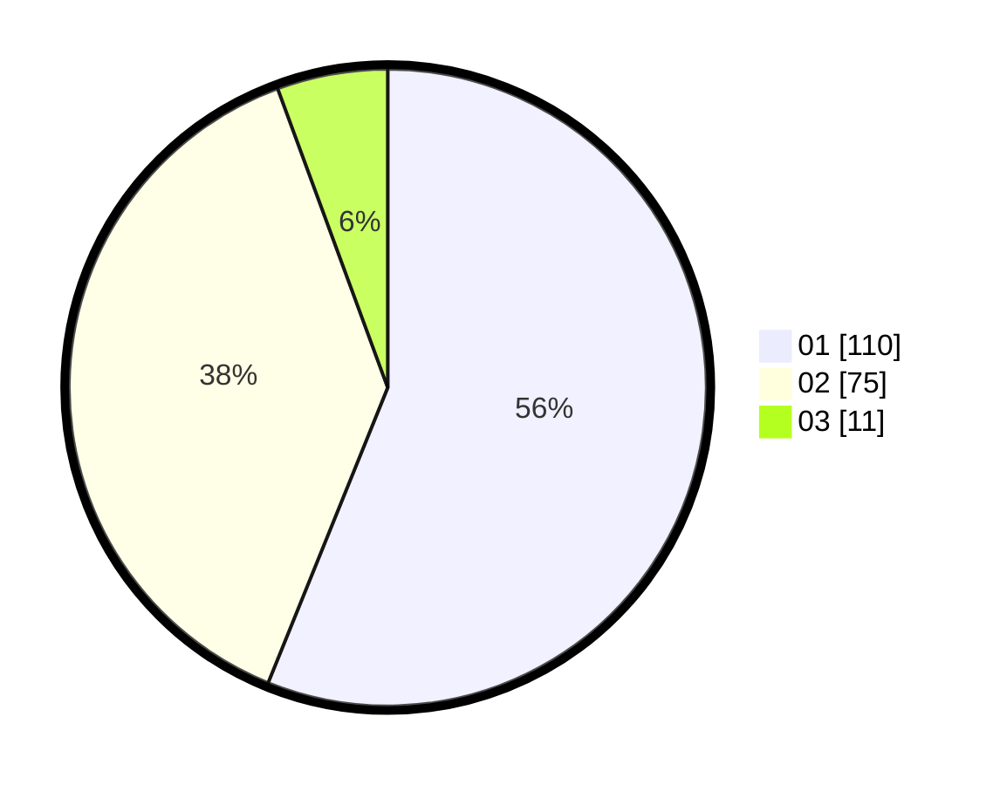

# Hasil

Hasil perolehan suara paslon dapat dilihat pada file paslon-01.txt, paslon-02.txt, dan paslon-03.txt.

Jika tidak ada, artinya data tersebut belum ada pada SIREKAP.

## Perolehan Suara

 * Paslon 01: **110**.
 * Paslon 02: **75**.
 * Paslon 03: **11**.

## Foto C Plano

https://sirekap-obj-formc.kpu.go.id/39de/pemilu/ppwp/31/71/08/10/03/3171081003004-20240215-003253--b9c7f9c8-70c3-4154-8dfc-e5333bf21a8e.jpg

https://sirekap-obj-formc.kpu.go.id/39de/pemilu/ppwp/31/71/08/10/03/3171081003004-20240215-003432--50947207-4bf8-4be4-be6d-6fc7c20149ab.jpg

https://sirekap-obj-formc.kpu.go.id/39de/pemilu/ppwp/31/71/08/10/03/3171081003004-20240215-003614--4208fd07-d8f2-4bae-8aaf-38beb43c7f4f.jpg

## DATA PEMILIH TETAP

Jumlah pemilih dalam DPT: **241**.
 * L: **127**.
 * P: **114**.

## DATA PENGGUNA HAK PILIH

Jumlah pengguna hak pilih dalam DPT: **190**.
 * L: **96**.
 * P: **94**.

Jumlah pengguna hak pilih dalam DPTb: **0**.
 * L: **0**.
 * P: **0**.

Jumlah pengguna hak pilih dalam DPK: **8**.
 * L: **3**.
 * P: **5**.

Jumlah pengguna hak pilih: **198**.
 * L: **99**.
 * P: **99**.

## JUMLAH SUARA SAH DAN TIDAK SAH

JUMLAH SELURUH SUARA SAH: **196**.

JUMLAH SUARA TIDAK SAH: **2**.

JUMLAH SELURUH SUARA SAH DAN SUARA TIDAK SAH: **198**.
