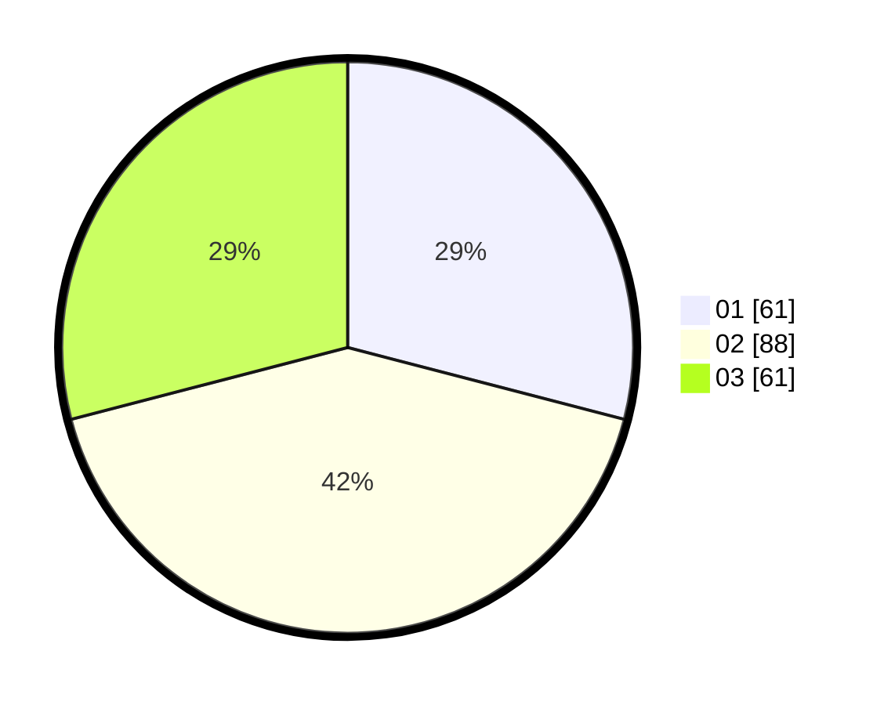

# Hasil

Hasil perolehan suara paslon dapat dilihat pada file paslon-01.txt, paslon-02.txt, dan paslon-03.txt.

Jika tidak ada, artinya data tersebut belum ada pada SIREKAP.

## Perolehan Suara

 * Paslon 01: **61**.
 * Paslon 02: **88**.
 * Paslon 03: **61**.

## Foto C Plano

https://sirekap-obj-formc.kpu.go.id/2fe7/pemilu/ppwp/31/71/08/10/03/3171081003009-20240215-012013--e19077d4-cd80-4dd7-b130-b5f5bea6e596.jpg

https://sirekap-obj-formc.kpu.go.id/2fe7/pemilu/ppwp/31/71/08/10/03/3171081003009-20240215-012127--ea8a3e1c-10ef-4f65-b838-3155e132bf76.jpg

https://sirekap-obj-formc.kpu.go.id/2fe7/pemilu/ppwp/31/71/08/10/03/3171081003009-20240215-012224--21a86cb5-5cc4-4ae6-8d7f-7a4002d6b5df.jpg

## DATA PEMILIH TETAP

Jumlah pemilih dalam DPT: **262**.
 * L: **134**.
 * P: **128**.

## DATA PENGGUNA HAK PILIH

Jumlah pengguna hak pilih dalam DPT: **196**.
 * L: **99**.
 * P: **97**.

Jumlah pengguna hak pilih dalam DPTb: **14**.
 * L: **9**.
 * P: **5**.

Jumlah pengguna hak pilih dalam DPK: **0**.
 * L: **0**.
 * P: **0**.

Jumlah pengguna hak pilih: **210**.
 * L: **108**.
 * P: **102**.

## JUMLAH SUARA SAH DAN TIDAK SAH

JUMLAH SELURUH SUARA SAH: **210**.

JUMLAH SUARA TIDAK SAH: **0**.

JUMLAH SELURUH SUARA SAH DAN SUARA TIDAK SAH: **210**.
