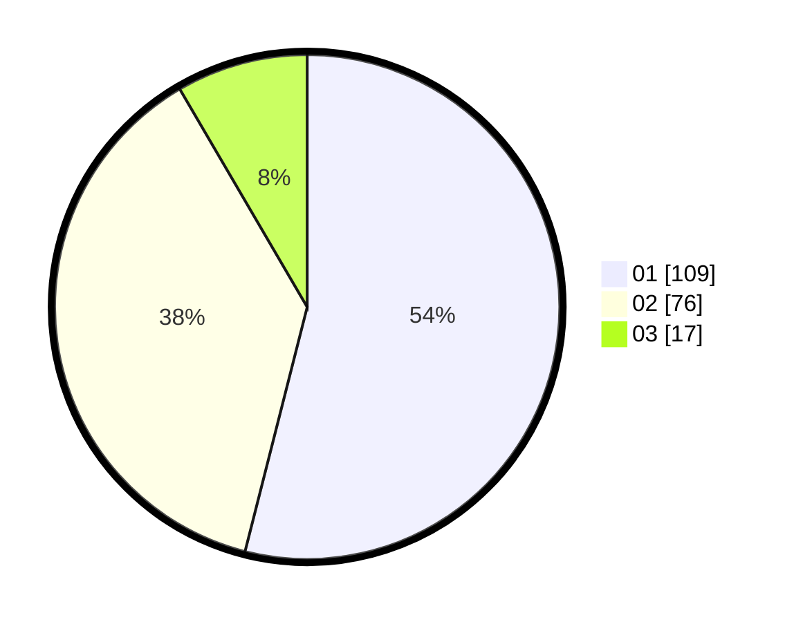

# Hasil

Hasil perolehan suara paslon dapat dilihat pada file paslon-01.txt, paslon-02.txt, dan paslon-03.txt.

Jika tidak ada, artinya data tersebut belum ada pada SIREKAP.

## Perolehan Suara

 * Paslon 01: **109**.
 * Paslon 02: **76**.
 * Paslon 03: **17**.

## Foto C Plano

https://sirekap-obj-formc.kpu.go.id/7765/pemilu/ppwp/31/71/08/10/03/3171081003013-20240214-212224--b4e1c6d7-7d10-4220-ae83-1b82e8c6c112.jpg

https://sirekap-obj-formc.kpu.go.id/7765/pemilu/ppwp/31/71/08/10/03/3171081003013-20240214-212409--c06e0e56-a6fb-46bb-9e74-e1845e889e17.jpg

https://sirekap-obj-formc.kpu.go.id/7765/pemilu/ppwp/31/71/08/10/03/3171081003013-20240214-212527--8833f217-2ca8-45cf-a91f-cc644bc4621d.jpg
