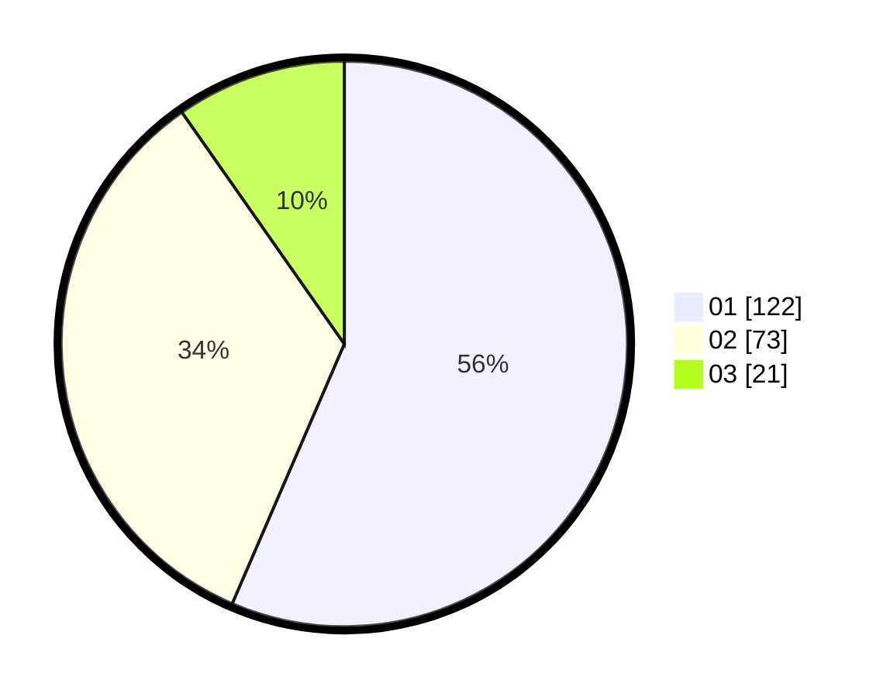

# Hasil

Hasil perolehan suara paslon dapat dilihat pada file paslon-01.txt, paslon-02.txt, dan paslon-03.txt.

Jika tidak ada, artinya data tersebut belum ada pada SIREKAP.

## Perolehan Suara

 * Paslon 01: **122**.
 * Paslon 02: **73**.
 * Paslon 03: **21**.

## Foto C Plano

https://sirekap-obj-formc.kpu.go.id/dd6e/pemilu/ppwp/31/71/08/10/03/3171081003014-20240214-230957--8a7395e0-1a57-42a5-b2cc-be221dda897c.jpg

https://sirekap-obj-formc.kpu.go.id/dd6e/pemilu/ppwp/31/71/08/10/03/3171081003014-20240214-231213--0bc5d2a1-10c8-43dc-ad56-206f822e3e26.jpg

https://sirekap-obj-formc.kpu.go.id/dd6e/pemilu/ppwp/31/71/08/10/03/3171081003014-20240214-231306--2e952835-cc7f-4fc5-bb5a-a91d36ac9f66.jpg

## DATA PEMILIH TETAP

Jumlah pemilih dalam DPT: **266**.
 * L: **133**.
 * P: **133**.

## DATA PENGGUNA HAK PILIH

Jumlah pengguna hak pilih dalam DPT: **213**.
 * L: **102**.
 * P: **111**.

Jumlah pengguna hak pilih dalam DPTb: **1**.
 * L: **1**.
 * P: **0**.

Jumlah pengguna hak pilih dalam DPK: **2**.
 * L: **0**.
 * P: **2**.

Jumlah pengguna hak pilih: **216**.
 * L: **103**.
 * P: **113**.

## JUMLAH SUARA SAH DAN TIDAK SAH

JUMLAH SELURUH SUARA SAH: **0**.

JUMLAH SUARA TIDAK SAH: **0**.

JUMLAH SELURUH SUARA SAH DAN SUARA TIDAK SAH: **0**.
