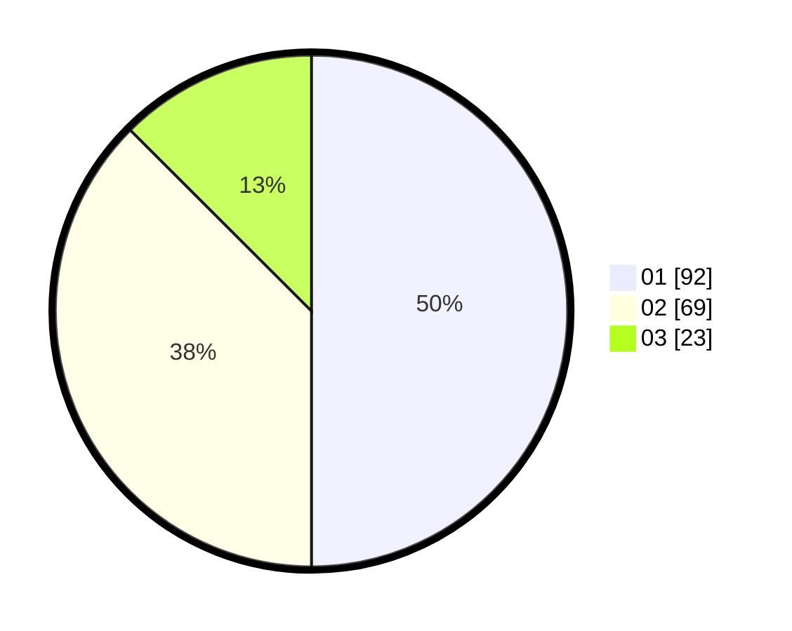

# Hasil

Hasil perolehan suara paslon dapat dilihat pada file paslon-01.txt, paslon-02.txt, dan paslon-03.txt.

Jika tidak ada, artinya data tersebut belum ada pada SIREKAP.

## Perolehan Suara

 * Paslon 01: **92**.
 * Paslon 02: **69**.
 * Paslon 03: **23**.

## Foto C Plano

https://sirekap-obj-formc.kpu.go.id/0012/pemilu/ppwp/31/71/08/10/03/3171081003022-20240214-224838--7a229840-01c7-40ca-b8e0-08e87fbebb27.jpg

https://sirekap-obj-formc.kpu.go.id/0012/pemilu/ppwp/31/71/08/10/03/3171081003022-20240214-222554--9948f437-9114-4eee-8e88-854e28cb026d.jpg

https://sirekap-obj-formc.kpu.go.id/0012/pemilu/ppwp/31/71/08/10/03/3171081003022-20240214-222902--982a09d4-8279-46ab-824d-4415f174dbdd.jpg

## DATA PEMILIH TETAP

Jumlah pemilih dalam DPT: **265**.
 * L: **130**.
 * P: **135**.

## DATA PENGGUNA HAK PILIH

Jumlah pengguna hak pilih dalam DPT: **193**.
 * L: **90**.
 * P: **103**.

Jumlah pengguna hak pilih dalam DPTb: **0**.
 * L: **0**.
 * P: **0**.

Jumlah pengguna hak pilih dalam DPK: **0**.
 * L: **0**.
 * P: **0**.

Jumlah pengguna hak pilih: **193**.
 * L: **90**.
 * P: **103**.

## JUMLAH SUARA SAH DAN TIDAK SAH

JUMLAH SELURUH SUARA SAH: **184**.

JUMLAH SUARA TIDAK SAH: **2**.

JUMLAH SELURUH SUARA SAH DAN SUARA TIDAK SAH: **186**.
