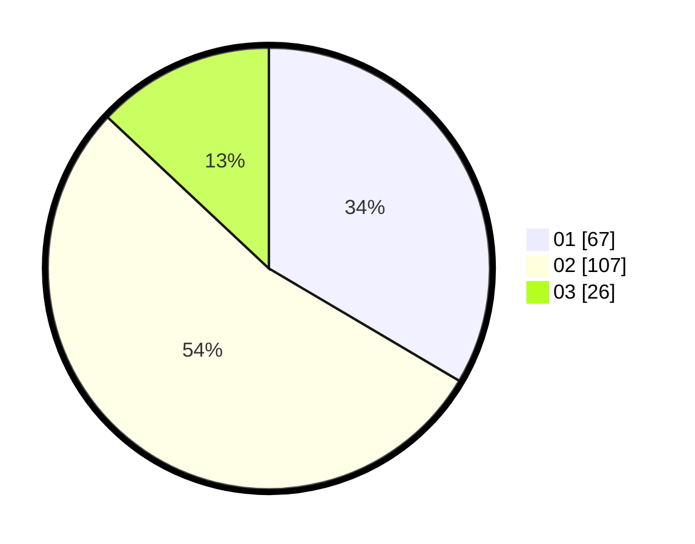

# Hasil

Hasil perolehan suara paslon dapat dilihat pada file paslon-01.txt, paslon-02.txt, dan paslon-03.txt.

Jika tidak ada, artinya data tersebut belum ada pada SIREKAP.

## Perolehan Suara

 * Paslon 01: **67**.
 * Paslon 02: **107**.
 * Paslon 03: **26**.

## Foto C Plano

https://sirekap-obj-formc.kpu.go.id/938e/pemilu/ppwp/31/71/08/10/03/3171081003023-20240215-000816--72d80275-b853-4ff4-ac73-4c46631e243e.jpg

https://sirekap-obj-formc.kpu.go.id/938e/pemilu/ppwp/31/71/08/10/03/3171081003023-20240215-001020--7ab305c7-82a7-49e5-8713-5d05dd6dcf41.jpg

https://sirekap-obj-formc.kpu.go.id/938e/pemilu/ppwp/31/71/08/10/03/3171081003023-20240215-001050--e42f6493-f918-4ee4-aed1-81dd0bab2feb.jpg
