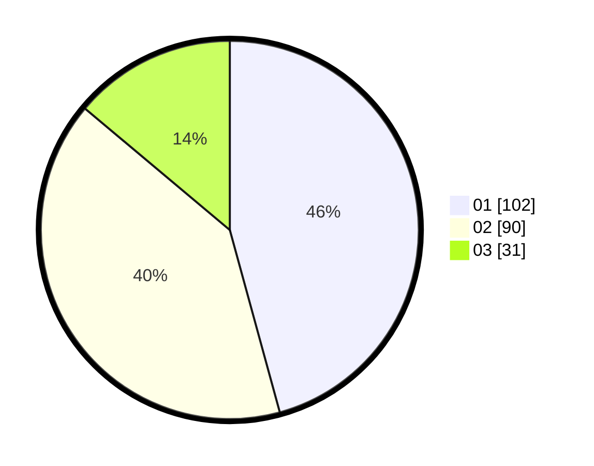

# Hasil

Hasil perolehan suara paslon dapat dilihat pada file paslon-01.txt, paslon-02.txt, dan paslon-03.txt.

Jika tidak ada, artinya data tersebut belum ada pada SIREKAP.

## Perolehan Suara

 * Paslon 01: **102**.
 * Paslon 02: **90**.
 * Paslon 03: **31**.

## Foto C Plano

https://sirekap-obj-formc.kpu.go.id/6af6/pemilu/ppwp/31/71/08/10/03/3171081003024-20240214-205026--a2b5d970-d75d-4bf2-a332-65692a2abf75.jpg

https://sirekap-obj-formc.kpu.go.id/6af6/pemilu/ppwp/31/71/08/10/03/3171081003024-20240214-193011--ec23f89c-7995-4d22-bd98-66eb48dcf065.jpg

https://sirekap-obj-formc.kpu.go.id/6af6/pemilu/ppwp/31/71/08/10/03/3171081003024-20240214-193140--8bc8aee0-bfd3-427a-9862-8a9300bcfdbf.jpg

## DATA PEMILIH TETAP

Jumlah pemilih dalam DPT: **269**.
 * L: **130**.
 * P: **139**.

## DATA PENGGUNA HAK PILIH

Jumlah pengguna hak pilih dalam DPT: **106**.
 * L: **102**.
 * P: **104**.

Jumlah pengguna hak pilih dalam DPTb: **7**.
 * L: **7**.
 * P: **0**.

Jumlah pengguna hak pilih dalam DPK: **11**.
 * L: **4**.
 * P: **7**.

Jumlah pengguna hak pilih: **224**.
 * L: **113**.
 * P: **111**.

## JUMLAH SUARA SAH DAN TIDAK SAH

JUMLAH SELURUH SUARA SAH: **223**.

JUMLAH SUARA TIDAK SAH: **1**.

JUMLAH SELURUH SUARA SAH DAN SUARA TIDAK SAH: **224**.
