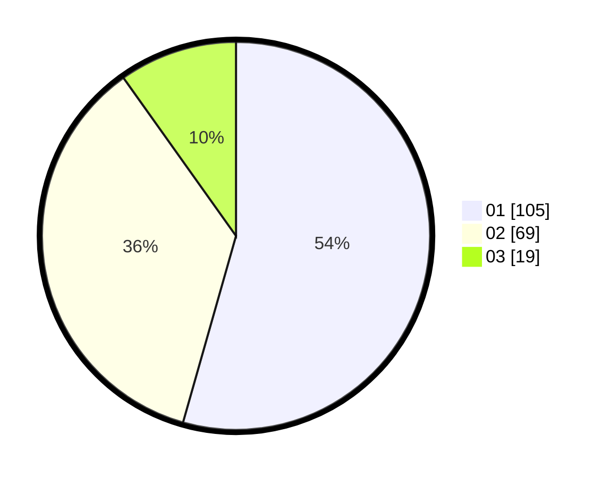

# Hasil

Hasil perolehan suara paslon dapat dilihat pada file paslon-01.txt, paslon-02.txt, dan paslon-03.txt.

Jika tidak ada, artinya data tersebut belum ada pada SIREKAP.

## Perolehan Suara

 * Paslon 01: **105**.
 * Paslon 02: **69**.
 * Paslon 03: **19**.

## Foto C Plano

https://sirekap-obj-formc.kpu.go.id/1ca4/pemilu/ppwp/31/71/08/10/03/3171081003028-20240214-211051--a2e9b21e-663f-4a98-bfb5-207d1f1f568f.jpg

https://sirekap-obj-formc.kpu.go.id/1ca4/pemilu/ppwp/31/71/08/10/03/3171081003028-20240214-193302--24bd98cd-edf3-4fa2-93ae-72438ef32e89.jpg

https://sirekap-obj-formc.kpu.go.id/1ca4/pemilu/ppwp/31/71/08/10/03/3171081003028-20240214-233502--295f008e-8a00-467e-abfd-5fa7b4325243.jpg
