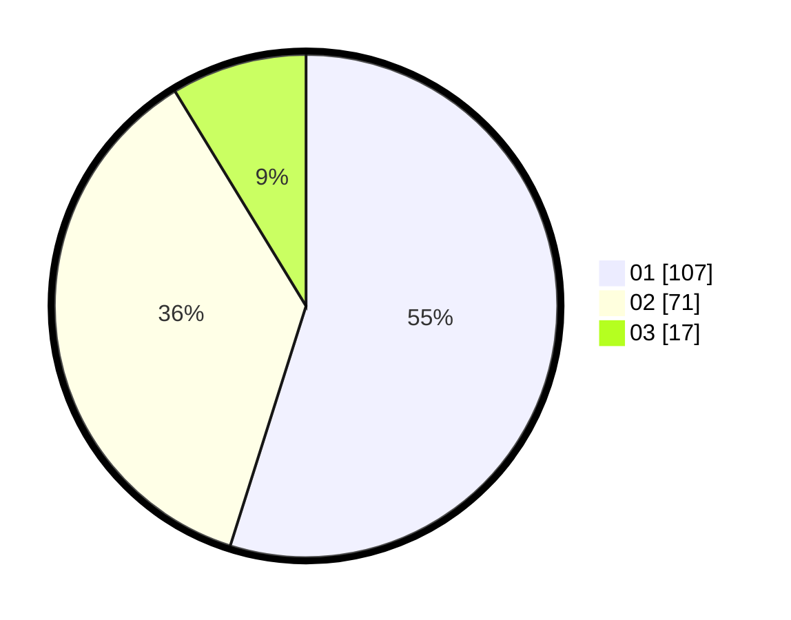

# Hasil

Hasil perolehan suara paslon dapat dilihat pada file paslon-01.txt, paslon-02.txt, dan paslon-03.txt.

Jika tidak ada, artinya data tersebut belum ada pada SIREKAP.

## Perolehan Suara

 * Paslon 01: **107**.
 * Paslon 02: **71**.
 * Paslon 03: **17**.

## Foto C Plano

https://sirekap-obj-formc.kpu.go.id/a02d/pemilu/ppwp/31/71/08/10/03/3171081003031-20240214-192200--41cb3373-128a-4193-88a4-3af8f07f7ebe.jpg

https://sirekap-obj-formc.kpu.go.id/a02d/pemilu/ppwp/31/71/08/10/03/3171081003031-20240214-155615--d51ae4e0-9ee4-46a5-9974-8e34c446bc6c.jpg

https://sirekap-obj-formc.kpu.go.id/a02d/pemilu/ppwp/31/71/08/10/03/3171081003031-20240214-155751--72f3c029-40ad-4373-a46c-caca501f68e0.jpg

## DATA PEMILIH TETAP

Jumlah pemilih dalam DPT: **263**.
 * L: **133**.
 * P: **130**.

## DATA PENGGUNA HAK PILIH

Jumlah pengguna hak pilih dalam DPT: **197**.
 * L: **98**.
 * P: **99**.

Jumlah pengguna hak pilih dalam DPTb: **0**.
 * L: **0**.
 * P: **0**.

Jumlah pengguna hak pilih dalam DPK: **0**.
 * L: **0**.
 * P: **0**.

Jumlah pengguna hak pilih: **197**.
 * L: **98**.
 * P: **99**.

## JUMLAH SUARA SAH DAN TIDAK SAH

JUMLAH SELURUH SUARA SAH: **195**.

JUMLAH SUARA TIDAK SAH: **2**.

JUMLAH SELURUH SUARA SAH DAN SUARA TIDAK SAH: **197**.
