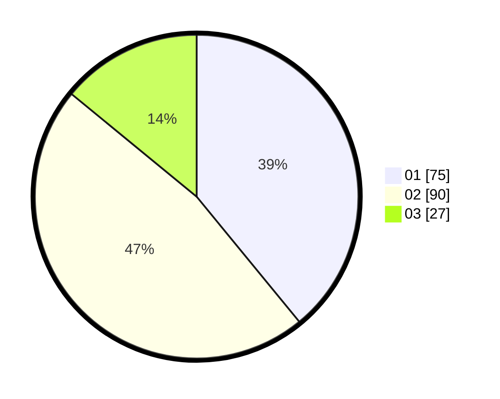

# Hasil

Hasil perolehan suara paslon dapat dilihat pada file paslon-01.txt, paslon-02.txt, dan paslon-03.txt.

Jika tidak ada, artinya data tersebut belum ada pada SIREKAP.

## Perolehan Suara

 * Paslon 01: **75**.
 * Paslon 02: **90**.
 * Paslon 03: **27**.

## Foto C Plano

https://sirekap-obj-formc.kpu.go.id/a1b6/pemilu/ppwp/31/71/08/10/03/3171081003032-20240215-224042--b4fa7c96-a206-47e4-8932-74e5f05fda98.jpg

https://sirekap-obj-formc.kpu.go.id/a1b6/pemilu/ppwp/31/71/08/10/03/3171081003032-20240215-224045--43b0ba5e-5bb2-41e0-9f21-f82b7ce846c0.jpg

https://sirekap-obj-formc.kpu.go.id/a1b6/pemilu/ppwp/31/71/08/10/03/3171081003032-20240215-224043--9f9acad5-fd4a-4000-b89b-d18dcc1897e7.jpg

## DATA PEMILIH TETAP

Jumlah pemilih dalam DPT: **263**.
 * L: **137**.
 * P: **126**.

## DATA PENGGUNA HAK PILIH

Jumlah pengguna hak pilih dalam DPT: **190**.
 * L: **94**.
 * P: **96**.

Jumlah pengguna hak pilih dalam DPTb: **0**.
 * L: **0**.
 * P: **0**.

Jumlah pengguna hak pilih dalam DPK: **5**.
 * L: **1**.
 * P: **4**.

Jumlah pengguna hak pilih: **195**.
 * L: **95**.
 * P: **100**.

## JUMLAH SUARA SAH DAN TIDAK SAH

JUMLAH SELURUH SUARA SAH: **192**.

JUMLAH SUARA TIDAK SAH: **3**.

JUMLAH SELURUH SUARA SAH DAN SUARA TIDAK SAH: **195**.
