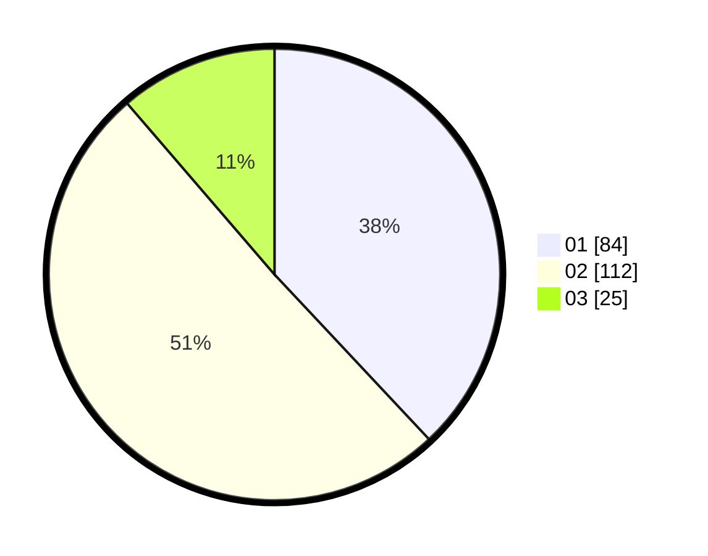

# Hasil

Hasil perolehan suara paslon dapat dilihat pada file paslon-01.txt, paslon-02.txt, dan paslon-03.txt.

Jika tidak ada, artinya data tersebut belum ada pada SIREKAP.

## Perolehan Suara

 * Paslon 01: **84**.
 * Paslon 02: **112**.
 * Paslon 03: **25**.

## Foto C Plano

https://sirekap-obj-formc.kpu.go.id/1392/pemilu/ppwp/31/71/08/10/03/3171081003036-20240214-231232--29b8054b-a5c9-4619-9c7f-2186f98c4532.jpg

https://sirekap-obj-formc.kpu.go.id/1392/pemilu/ppwp/31/71/08/10/03/3171081003036-20240214-231512--9e09c2a2-518b-4c80-9c84-6acc0d024f53.jpg

https://sirekap-obj-formc.kpu.go.id/1392/pemilu/ppwp/31/71/08/10/03/3171081003036-20240214-204322--b85145b2-c978-46b6-95c6-d05a0874668a.jpg
