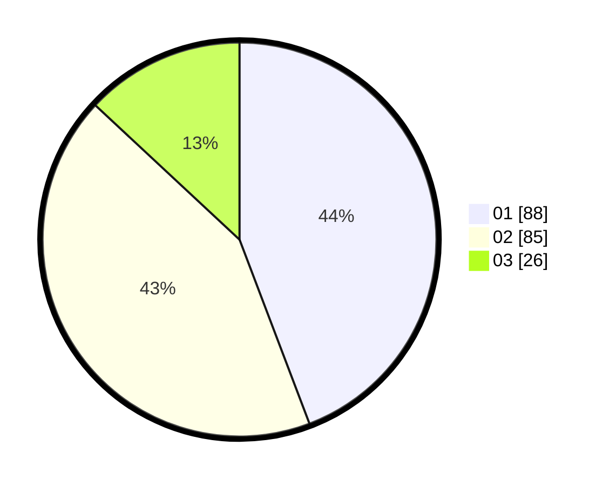

# Hasil

Hasil perolehan suara paslon dapat dilihat pada file paslon-01.txt, paslon-02.txt, dan paslon-03.txt.

Jika tidak ada, artinya data tersebut belum ada pada SIREKAP.

## Perolehan Suara

 * Paslon 01: **88**.
 * Paslon 02: **85**.
 * Paslon 03: **26**.

## Foto C Plano

https://sirekap-obj-formc.kpu.go.id/1b99/pemilu/ppwp/31/71/08/10/03/3171081003040-20240216-013557--b6bc4dd1-3243-43a8-be0b-0bae947b6285.jpg

https://sirekap-obj-formc.kpu.go.id/1b99/pemilu/ppwp/31/71/08/10/03/3171081003040-20240216-013558--2282501e-1d44-4083-8eb0-0dd698d79aaf.jpg

https://sirekap-obj-formc.kpu.go.id/1b99/pemilu/ppwp/31/71/08/10/03/3171081003040-20240216-013558--54254d19-d55f-4015-b08b-b164bf45c16c.jpg

## DATA PEMILIH TETAP

Jumlah pemilih dalam DPT: **282**.
 * L: **140**.
 * P: **142**.

## DATA PENGGUNA HAK PILIH

Jumlah pengguna hak pilih dalam DPT: **201**.
 * L: **94**.
 * P: **107**.

Jumlah pengguna hak pilih dalam DPTb: **1**.
 * L: **1**.
 * P: **0**.

Jumlah pengguna hak pilih dalam DPK: **1**.
 * L: **0**.
 * P: **1**.

Jumlah pengguna hak pilih: **203**.
 * L: **95**.
 * P: **108**.

## JUMLAH SUARA SAH DAN TIDAK SAH

JUMLAH SELURUH SUARA SAH: **199**.

JUMLAH SUARA TIDAK SAH: **4**.

JUMLAH SELURUH SUARA SAH DAN SUARA TIDAK SAH: **203**.
