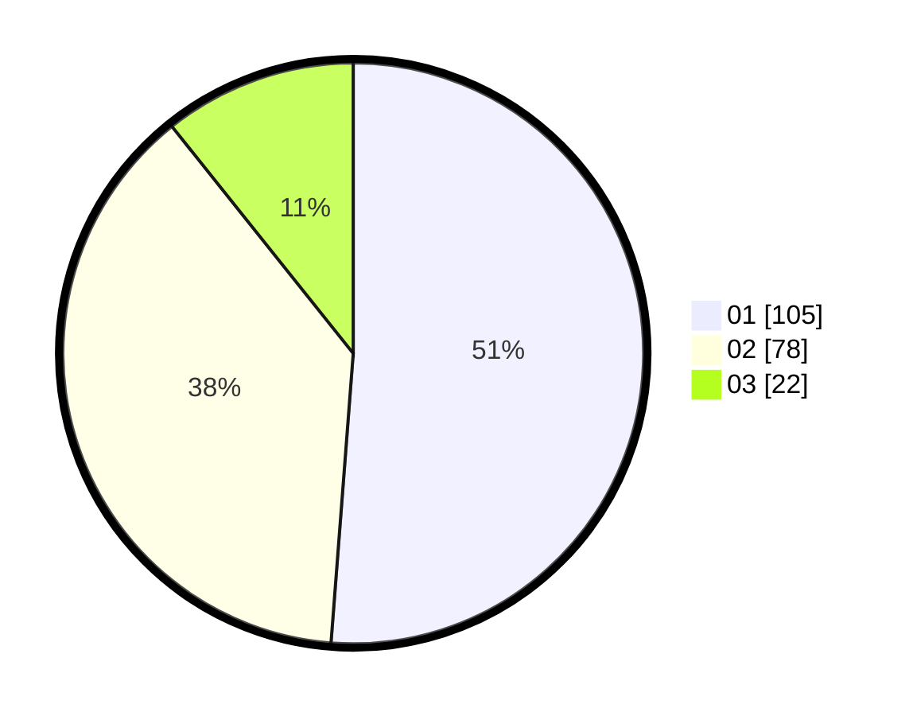

# Hasil

Hasil perolehan suara paslon dapat dilihat pada file paslon-01.txt, paslon-02.txt, dan paslon-03.txt.

Jika tidak ada, artinya data tersebut belum ada pada SIREKAP.

## Perolehan Suara

 * Paslon 01: **105**.
 * Paslon 02: **78**.
 * Paslon 03: **22**.

## Foto C Plano

https://sirekap-obj-formc.kpu.go.id/1c61/pemilu/ppwp/31/71/08/10/03/3171081003044-20240215-015118--1e2324f4-ea83-4823-b9b1-1045d876da08.jpg

https://sirekap-obj-formc.kpu.go.id/1c61/pemilu/ppwp/31/71/08/10/03/3171081003044-20240215-015225--3aae2b82-85fb-4362-949b-018dfba8ebd9.jpg

https://sirekap-obj-formc.kpu.go.id/1c61/pemilu/ppwp/31/71/08/10/03/3171081003044-20240215-015518--8c545038-6b53-4b99-b84f-4b5d97562f6d.jpg
