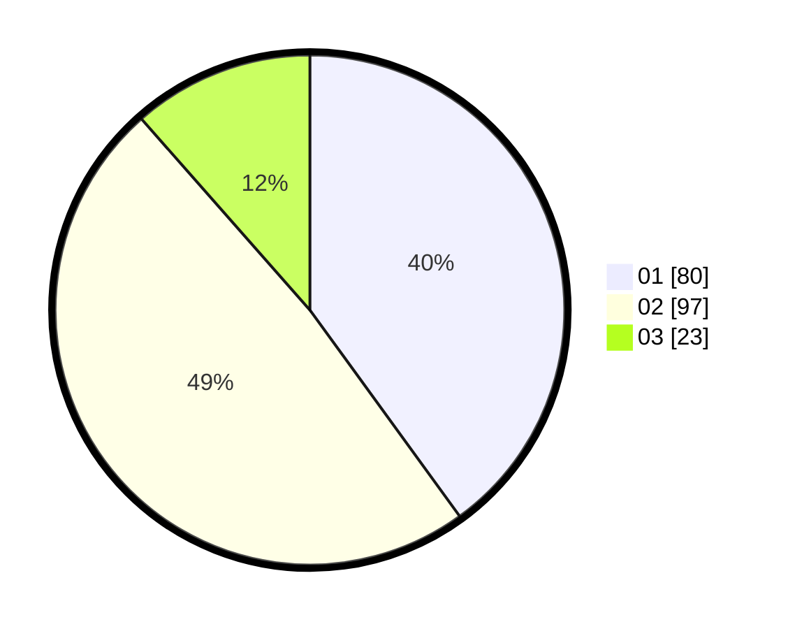

# Hasil

Hasil perolehan suara paslon dapat dilihat pada file paslon-01.txt, paslon-02.txt, dan paslon-03.txt.

Jika tidak ada, artinya data tersebut belum ada pada SIREKAP.

## Perolehan Suara

 * Paslon 01: **80**.
 * Paslon 02: **97**.
 * Paslon 03: **23**.

## Foto C Plano

https://sirekap-obj-formc.kpu.go.id/ac73/pemilu/ppwp/31/71/08/10/03/3171081003050-20240216-103327--3af162b0-ce92-4cde-ac96-de8b14866290.jpg

https://sirekap-obj-formc.kpu.go.id/ac73/pemilu/ppwp/31/71/08/10/03/3171081003050-20240216-103329--4cedf5ff-b3c3-4f38-a071-5c7f7d689cc4.jpg

https://sirekap-obj-formc.kpu.go.id/ac73/pemilu/ppwp/31/71/08/10/03/3171081003050-20240216-103329--1c520050-6ee7-4689-990e-11a804e11f73.jpg

## DATA PEMILIH TETAP

Jumlah pemilih dalam DPT: **265**.
 * L: **141**.
 * P: **124**.

## DATA PENGGUNA HAK PILIH

Jumlah pengguna hak pilih dalam DPT: **201**.
 * L: **104**.
 * P: **97**.

Jumlah pengguna hak pilih dalam DPTb: **0**.
 * L: **0**.
 * P: **0**.

Jumlah pengguna hak pilih dalam DPK: **0**.
 * L: **0**.
 * P: **0**.

Jumlah pengguna hak pilih: **203**.
 * L: **105**.
 * P: **98**.

## JUMLAH SUARA SAH DAN TIDAK SAH

JUMLAH SELURUH SUARA SAH: **200**.

JUMLAH SUARA TIDAK SAH: **3**.

JUMLAH SELURUH SUARA SAH DAN SUARA TIDAK SAH: **203**.
