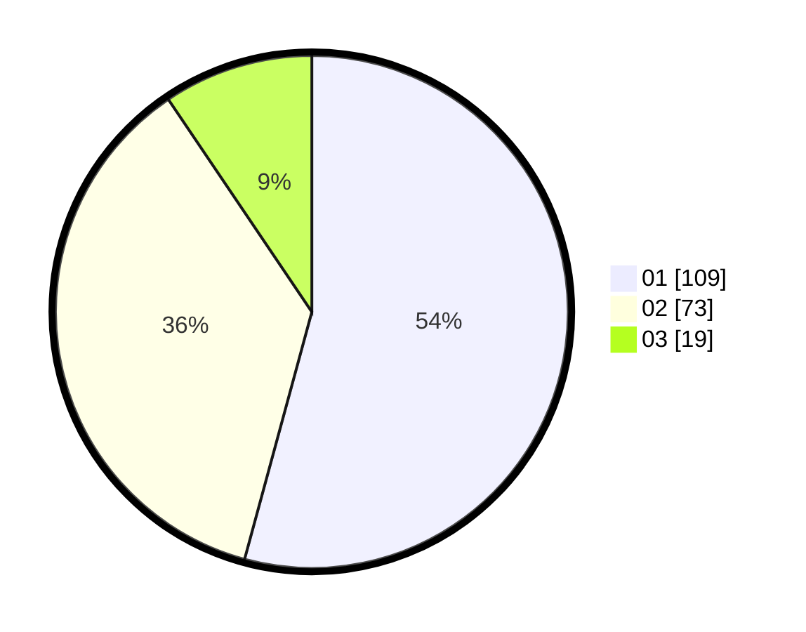

# Hasil

Hasil perolehan suara paslon dapat dilihat pada file paslon-01.txt, paslon-02.txt, dan paslon-03.txt.

Jika tidak ada, artinya data tersebut belum ada pada SIREKAP.

## Perolehan Suara

 * Paslon 01: **109**.
 * Paslon 02: **73**.
 * Paslon 03: **19**.

## Foto C Plano

https://sirekap-obj-formc.kpu.go.id/bfcb/pemilu/ppwp/31/71/08/10/03/3171081003056-20240214-155729--ecbc8030-d0e8-49a0-89ea-48cf7d6a3c8c.jpg

https://sirekap-obj-formc.kpu.go.id/bfcb/pemilu/ppwp/31/71/08/10/03/3171081003056-20240214-223628--6b37bf87-a300-43ac-9288-a2e2d70c82f6.jpg

https://sirekap-obj-formc.kpu.go.id/bfcb/pemilu/ppwp/31/71/08/10/03/3171081003056-20240217-162815--1257ffeb-ca4e-46b3-81a1-b39b2e8736f9.jpg

## DATA PEMILIH TETAP

Jumlah pemilih dalam DPT: **256**.
 * L: **128**.
 * P: **128**.

## DATA PENGGUNA HAK PILIH

Jumlah pengguna hak pilih dalam DPT: **195**.
 * L: **89**.
 * P: **106**.

Jumlah pengguna hak pilih dalam DPTb: **7**.
 * L: **3**.
 * P: **4**.

Jumlah pengguna hak pilih dalam DPK: **0**.
 * L: **0**.
 * P: **0**.

Jumlah pengguna hak pilih: **202**.
 * L: **92**.
 * P: **110**.

## JUMLAH SUARA SAH DAN TIDAK SAH

JUMLAH SELURUH SUARA SAH: **201**.

JUMLAH SUARA TIDAK SAH: **1**.

JUMLAH SELURUH SUARA SAH DAN SUARA TIDAK SAH: **202**.
