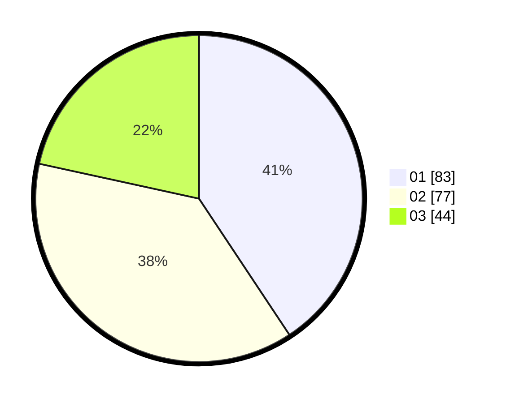

# Hasil

Hasil perolehan suara paslon dapat dilihat pada file paslon-01.txt, paslon-02.txt, dan paslon-03.txt.

Jika tidak ada, artinya data tersebut belum ada pada SIREKAP.

## Perolehan Suara

 * Paslon 01: **83**.
 * Paslon 02: **77**.
 * Paslon 03: **44**.

## Foto C Plano

https://sirekap-obj-formc.kpu.go.id/3403/pemilu/ppwp/31/71/08/10/03/3171081003057-20240215-022247--83e8c670-46b7-4dd2-ae0f-f6b2dc91c417.jpg

https://sirekap-obj-formc.kpu.go.id/3403/pemilu/ppwp/31/71/08/10/03/3171081003057-20240215-022344--5d04950b-25be-43f4-ae19-9ac36f47e23d.jpg

https://sirekap-obj-formc.kpu.go.id/3403/pemilu/ppwp/31/71/08/10/03/3171081003057-20240215-022426--380e78e5-6a1c-4583-baa2-059cc711b6c9.jpg

## DATA PEMILIH TETAP

Jumlah pemilih dalam DPT: **259**.
 * L: **127**.
 * P: **132**.

## DATA PENGGUNA HAK PILIH

Jumlah pengguna hak pilih dalam DPT: **206**.
 * L: **96**.
 * P: **110**.

Jumlah pengguna hak pilih dalam DPTb: **4**.
 * L: **1**.
 * P: **3**.

Jumlah pengguna hak pilih dalam DPK: **0**.
 * L: **0**.
 * P: **0**.

Jumlah pengguna hak pilih: **210**.
 * L: **97**.
 * P: **113**.

## JUMLAH SUARA SAH DAN TIDAK SAH

JUMLAH SELURUH SUARA SAH: **204**.

JUMLAH SUARA TIDAK SAH: **6**.

JUMLAH SELURUH SUARA SAH DAN SUARA TIDAK SAH: **210**.
