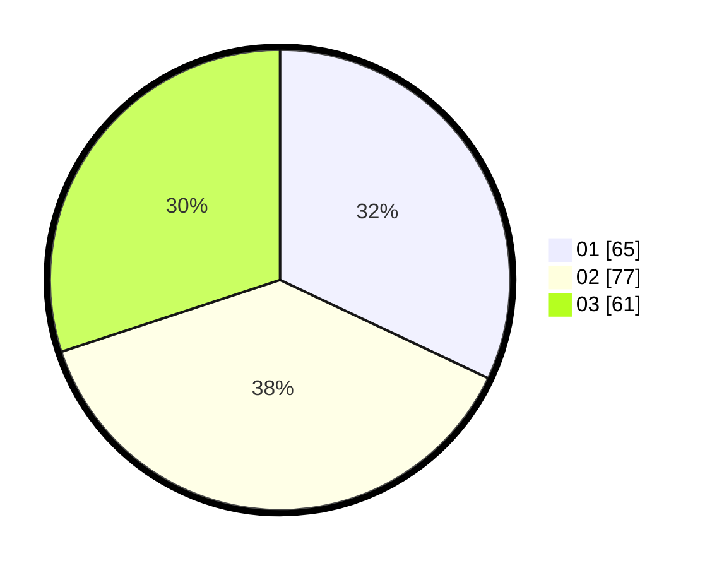

# Hasil

Hasil perolehan suara paslon dapat dilihat pada file paslon-01.txt, paslon-02.txt, dan paslon-03.txt.

Jika tidak ada, artinya data tersebut belum ada pada SIREKAP.

## Perolehan Suara

 * Paslon 01: **65**.
 * Paslon 02: **77**.
 * Paslon 03: **61**.

## Foto C Plano

https://sirekap-obj-formc.kpu.go.id/5370/pemilu/ppwp/31/71/08/10/03/3171081003059-20240214-193201--c0dea9b7-84f0-4736-bcd4-3830691d5055.jpg

https://sirekap-obj-formc.kpu.go.id/5370/pemilu/ppwp/31/71/08/10/03/3171081003059-20240214-193206--d9fc6f05-7e31-484c-8c8b-626da7adcf6d.jpg

https://sirekap-obj-formc.kpu.go.id/5370/pemilu/ppwp/31/71/08/10/03/3171081003059-20240214-193213--635edaf3-f18f-4f5b-956a-511d7f7c6681.jpg

## DATA PEMILIH TETAP

Jumlah pemilih dalam DPT: **256**.
 * L: **143**.
 * P: **113**.

## DATA PENGGUNA HAK PILIH

Jumlah pengguna hak pilih dalam DPT: **204**.
 * L: **116**.
 * P: **88**.

Jumlah pengguna hak pilih dalam DPTb: **0**.
 * L: **0**.
 * P: **0**.

Jumlah pengguna hak pilih dalam DPK: **3**.
 * L: **1**.
 * P: **2**.

Jumlah pengguna hak pilih: **207**.
 * L: **117**.
 * P: **90**.

## JUMLAH SUARA SAH DAN TIDAK SAH

JUMLAH SELURUH SUARA SAH: **203**.

JUMLAH SUARA TIDAK SAH: **4**.

JUMLAH SELURUH SUARA SAH DAN SUARA TIDAK SAH: **207**.
