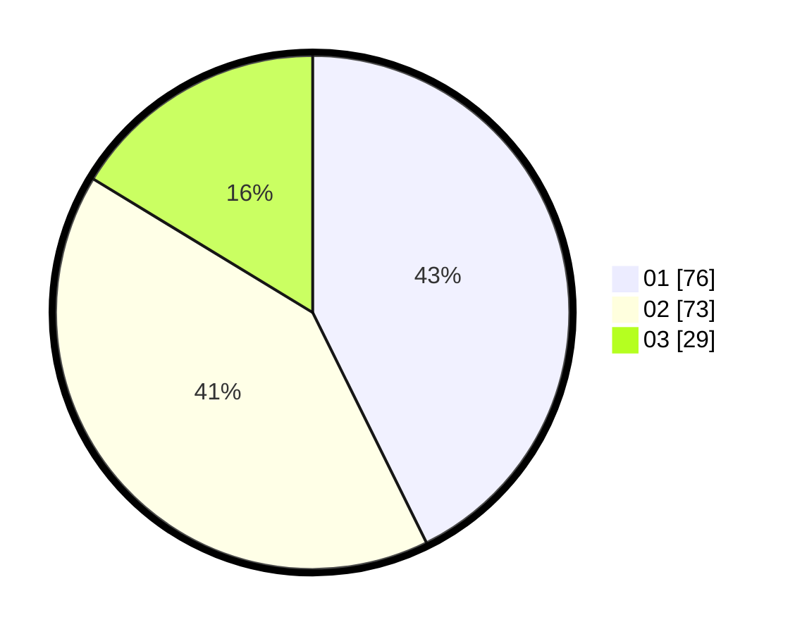

# Hasil

Hasil perolehan suara paslon dapat dilihat pada file paslon-01.txt, paslon-02.txt, dan paslon-03.txt.

Jika tidak ada, artinya data tersebut belum ada pada SIREKAP.

## Perolehan Suara

 * Paslon 01: **76**.
 * Paslon 02: **73**.
 * Paslon 03: **29**.

## Foto C Plano

https://sirekap-obj-formc.kpu.go.id/d212/pemilu/ppwp/31/71/08/10/04/3171081004001-20240216-162600--1f7cd631-499e-44de-ac29-539ae9863990.jpg

https://sirekap-obj-formc.kpu.go.id/d212/pemilu/ppwp/31/71/08/10/04/3171081004001-20240214-234603--4c53df33-1a20-4c5d-99f2-7851403a4fef.jpg

https://sirekap-obj-formc.kpu.go.id/d212/pemilu/ppwp/31/71/08/10/04/3171081004001-20240214-234907--fb2e1cd5-4c32-4fc6-9a20-5c4b624e07c4.jpg
