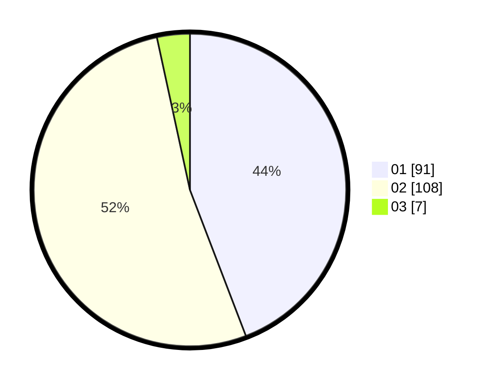

# Hasil

Hasil perolehan suara paslon dapat dilihat pada file paslon-01.txt, paslon-02.txt, dan paslon-03.txt.

Jika tidak ada, artinya data tersebut belum ada pada SIREKAP.

## Perolehan Suara

 * Paslon 01: **91**.
 * Paslon 02: **108**.
 * Paslon 03: **7**.

## Foto C Plano

https://sirekap-obj-formc.kpu.go.id/f076/pemilu/ppwp/31/71/08/10/04/3171081004005-20240216-062522--4cf9fb78-bd4d-4b57-8099-66fb4d0ff812.jpg

https://sirekap-obj-formc.kpu.go.id/f076/pemilu/ppwp/31/71/08/10/04/3171081004005-20240216-050937--8026f510-8069-476f-9481-6b3ec4986193.jpg

https://sirekap-obj-formc.kpu.go.id/f076/pemilu/ppwp/31/71/08/10/04/3171081004005-20240216-050930--1fd209fb-763a-4ff1-9964-e726a667aec1.jpg

## DATA PEMILIH TETAP

Jumlah pemilih dalam DPT: **270**.
 * L: **133**.
 * P: **137**.

## DATA PENGGUNA HAK PILIH

Jumlah pengguna hak pilih dalam DPT: **210**.
 * L: **101**.
 * P: **109**.

Jumlah pengguna hak pilih dalam DPTb: **0**.
 * L: **0**.
 * P: **0**.

Jumlah pengguna hak pilih dalam DPK: **0**.
 * L: **0**.
 * P: **0**.

Jumlah pengguna hak pilih: **210**.
 * L: **101**.
 * P: **109**.

## JUMLAH SUARA SAH DAN TIDAK SAH

JUMLAH SELURUH SUARA SAH: **206**.

JUMLAH SUARA TIDAK SAH: **4**.

JUMLAH SELURUH SUARA SAH DAN SUARA TIDAK SAH: **210**.
