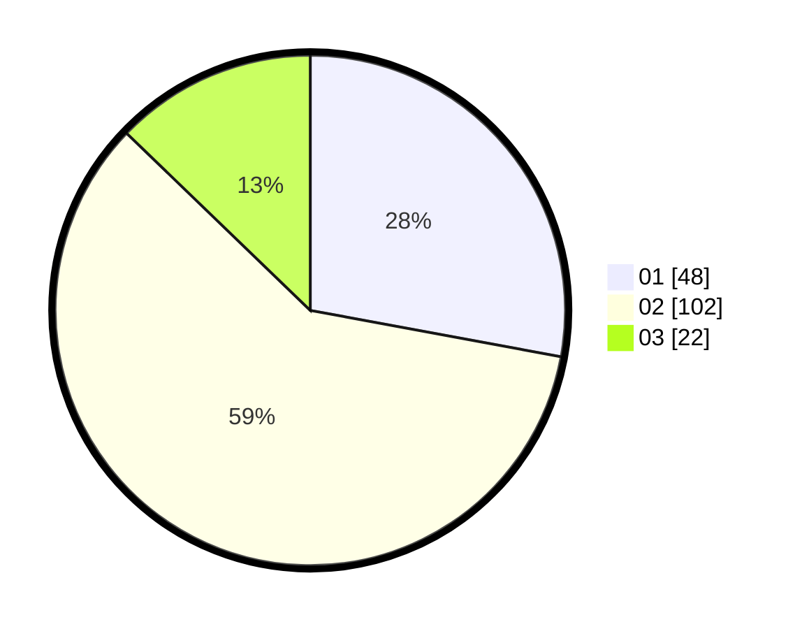

# Hasil

Hasil perolehan suara paslon dapat dilihat pada file paslon-01.txt, paslon-02.txt, dan paslon-03.txt.

Jika tidak ada, artinya data tersebut belum ada pada SIREKAP.

## Perolehan Suara

 * Paslon 01: **48**.
 * Paslon 02: **102**.
 * Paslon 03: **22**.

## Foto C Plano

https://sirekap-obj-formc.kpu.go.id/1282/pemilu/ppwp/31/71/08/10/04/3171081004008-20240214-211007--c5476501-fdc4-4769-ad8f-fb969080f554.jpg

https://sirekap-obj-formc.kpu.go.id/1282/pemilu/ppwp/31/71/08/10/04/3171081004008-20240216-220438--cfddf516-0edb-4026-bacc-63f27c6c8d7b.jpg

https://sirekap-obj-formc.kpu.go.id/1282/pemilu/ppwp/31/71/08/10/04/3171081004008-20240214-210859--3f742d78-0938-45c0-8c50-38e85fbf9d8b.jpg

## DATA PEMILIH TETAP

Jumlah pemilih dalam DPT: **236**.
 * L: **122**.
 * P: **114**.

## DATA PENGGUNA HAK PILIH

Jumlah pengguna hak pilih dalam DPT: **176**.
 * L: **84**.
 * P: **92**.

Jumlah pengguna hak pilih dalam DPTb: **0**.
 * L: **0**.
 * P: **0**.

Jumlah pengguna hak pilih dalam DPK: **0**.
 * L: **0**.
 * P: **0**.

Jumlah pengguna hak pilih: **176**.
 * L: **84**.
 * P: **92**.

## JUMLAH SUARA SAH DAN TIDAK SAH

JUMLAH SELURUH SUARA SAH: **172**.

JUMLAH SUARA TIDAK SAH: **4**.

JUMLAH SELURUH SUARA SAH DAN SUARA TIDAK SAH: **176**.
