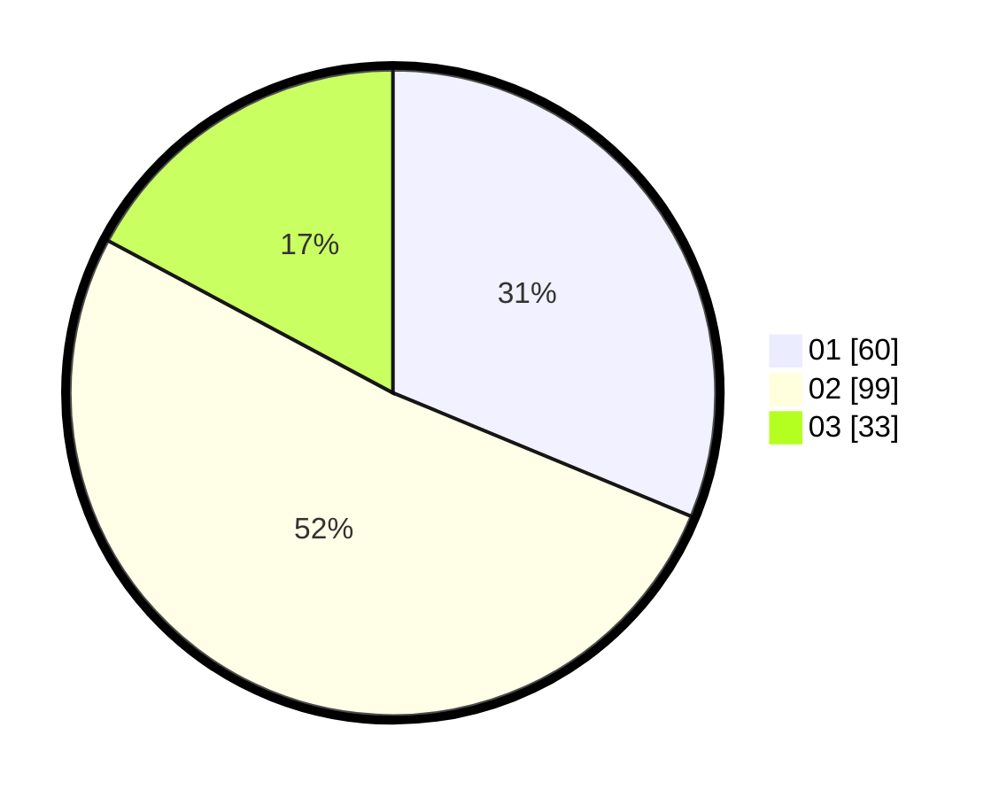

# Hasil

Hasil perolehan suara paslon dapat dilihat pada file paslon-01.txt, paslon-02.txt, dan paslon-03.txt.

Jika tidak ada, artinya data tersebut belum ada pada SIREKAP.

## Perolehan Suara

 * Paslon 01: **60**.
 * Paslon 02: **99**.
 * Paslon 03: **33**.

## Foto C Plano

https://sirekap-obj-formc.kpu.go.id/37f8/pemilu/ppwp/31/71/08/10/04/3171081004011-20240216-155452--22d3074b-57eb-45bf-ab07-302609f0b80f.jpg

https://sirekap-obj-formc.kpu.go.id/37f8/pemilu/ppwp/31/71/08/10/04/3171081004011-20240216-155453--f99cac7f-99aa-4b43-bbd5-312e5d0c57ee.jpg

https://sirekap-obj-formc.kpu.go.id/37f8/pemilu/ppwp/31/71/08/10/04/3171081004011-20240216-155453--b0a01e21-3d56-4804-ae41-50fb08df3f19.jpg

## DATA PEMILIH TETAP

Jumlah pemilih dalam DPT: **252**.
 * L: **118**.
 * P: **134**.

## DATA PENGGUNA HAK PILIH

Jumlah pengguna hak pilih dalam DPT: **193**.
 * L: **90**.
 * P: **103**.

Jumlah pengguna hak pilih dalam DPTb: **1**.
 * L: **1**.
 * P: **0**.

Jumlah pengguna hak pilih dalam DPK: **0**.
 * L: **0**.
 * P: **0**.

Jumlah pengguna hak pilih: **194**.
 * L: **91**.
 * P: **103**.

## JUMLAH SUARA SAH DAN TIDAK SAH

JUMLAH SELURUH SUARA SAH: **192**.

JUMLAH SUARA TIDAK SAH: **2**.

JUMLAH SELURUH SUARA SAH DAN SUARA TIDAK SAH: **194**.
