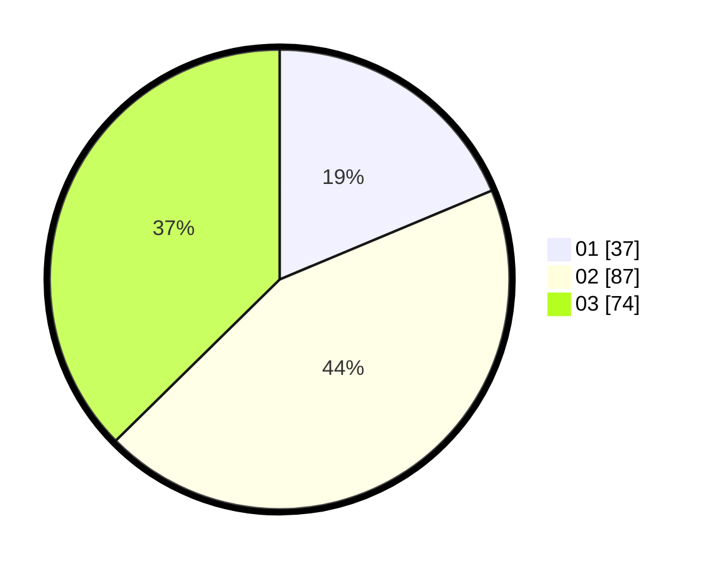

# Hasil

Hasil perolehan suara paslon dapat dilihat pada file paslon-01.txt, paslon-02.txt, dan paslon-03.txt.

Jika tidak ada, artinya data tersebut belum ada pada SIREKAP.

## Perolehan Suara

 * Paslon 01: **37**.
 * Paslon 02: **87**.
 * Paslon 03: **74**.

## Foto C Plano

https://sirekap-obj-formc.kpu.go.id/7055/pemilu/ppwp/31/71/08/10/04/3171081004015-20240216-150351--856aba0f-456a-4083-952e-b06adf0c1073.jpg

https://sirekap-obj-formc.kpu.go.id/7055/pemilu/ppwp/31/71/08/10/04/3171081004015-20240216-150353--4f0384cc-dc0a-4cc7-a022-ea53695262b3.jpg

https://sirekap-obj-formc.kpu.go.id/7055/pemilu/ppwp/31/71/08/10/04/3171081004015-20240216-150352--a9eb5942-6c96-45c9-aae3-c22770f1fe4e.jpg

## DATA PEMILIH TETAP

Jumlah pemilih dalam DPT: **245**.
 * L: **120**.
 * P: **125**.

## DATA PENGGUNA HAK PILIH

Jumlah pengguna hak pilih dalam DPT: **185**.
 * L: **89**.
 * P: **96**.

Jumlah pengguna hak pilih dalam DPTb: **13**.
 * L: **5**.
 * P: **8**.

Jumlah pengguna hak pilih dalam DPK: **3**.
 * L: **0**.
 * P: **3**.

Jumlah pengguna hak pilih: **201**.
 * L: **94**.
 * P: **107**.

## JUMLAH SUARA SAH DAN TIDAK SAH

JUMLAH SELURUH SUARA SAH: **198**.

JUMLAH SUARA TIDAK SAH: **3**.

JUMLAH SELURUH SUARA SAH DAN SUARA TIDAK SAH: **201**.
