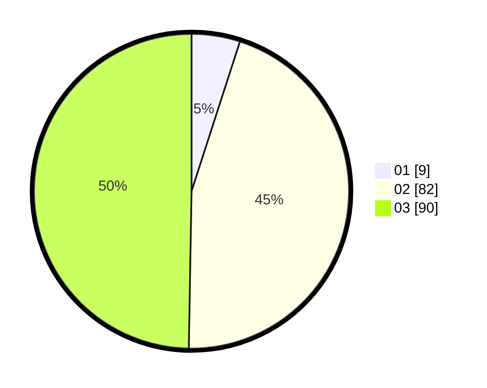

# Hasil

Hasil perolehan suara paslon dapat dilihat pada file paslon-01.txt, paslon-02.txt, dan paslon-03.txt.

Jika tidak ada, artinya data tersebut belum ada pada SIREKAP.

## Perolehan Suara

 * Paslon 01: **9**.
 * Paslon 02: **82**.
 * Paslon 03: **90**.

## Foto C Plano

https://sirekap-obj-formc.kpu.go.id/4b2a/pemilu/ppwp/31/71/08/10/04/3171081004016-20240214-212155--72d6a4f8-6b55-413c-9fbc-88b1f96fd5cb.jpg

https://sirekap-obj-formc.kpu.go.id/4b2a/pemilu/ppwp/31/71/08/10/04/3171081004016-20240214-200307--29344a1b-4b79-4b9a-b890-64107ae22c59.jpg

https://sirekap-obj-formc.kpu.go.id/4b2a/pemilu/ppwp/31/71/08/10/04/3171081004016-20240214-200513--4d685039-9437-47ef-af6d-af4f1186c7ed.jpg
