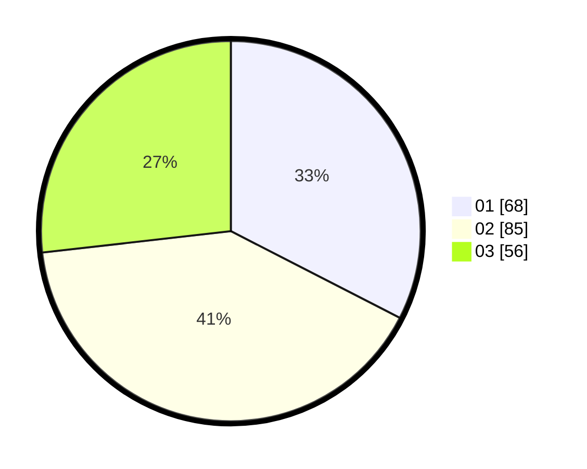

# Hasil

Hasil perolehan suara paslon dapat dilihat pada file paslon-01.txt, paslon-02.txt, dan paslon-03.txt.

Jika tidak ada, artinya data tersebut belum ada pada SIREKAP.

## Perolehan Suara

 * Paslon 01: **68**.
 * Paslon 02: **85**.
 * Paslon 03: **56**.

## Foto C Plano

https://sirekap-obj-formc.kpu.go.id/5b26/pemilu/ppwp/31/71/08/10/04/3171081004018-20240214-232039--ce7c6115-c109-4979-9067-50da74d3da4c.jpg

https://sirekap-obj-formc.kpu.go.id/5b26/pemilu/ppwp/31/71/08/10/04/3171081004018-20240214-232709--70d8f7d4-84c9-46e9-b80b-c413d9bc789a.jpg

https://sirekap-obj-formc.kpu.go.id/5b26/pemilu/ppwp/31/71/08/10/04/3171081004018-20240214-233027--6cf370c9-be05-49ef-8d96-75857a2761a5.jpg

## DATA PEMILIH TETAP

Jumlah pemilih dalam DPT: **262**.
 * L: **130**.
 * P: **132**.

## DATA PENGGUNA HAK PILIH

Jumlah pengguna hak pilih dalam DPT: **207**.
 * L: **106**.
 * P: **101**.

Jumlah pengguna hak pilih dalam DPTb: **2**.
 * L: **1**.
 * P: **1**.

Jumlah pengguna hak pilih dalam DPK: **3**.
 * L: **3**.
 * P: **0**.

Jumlah pengguna hak pilih: **212**.
 * L: **110**.
 * P: **102**.

## JUMLAH SUARA SAH DAN TIDAK SAH

JUMLAH SELURUH SUARA SAH: **209**.

JUMLAH SUARA TIDAK SAH: **7**.

JUMLAH SELURUH SUARA SAH DAN SUARA TIDAK SAH: **212**.
