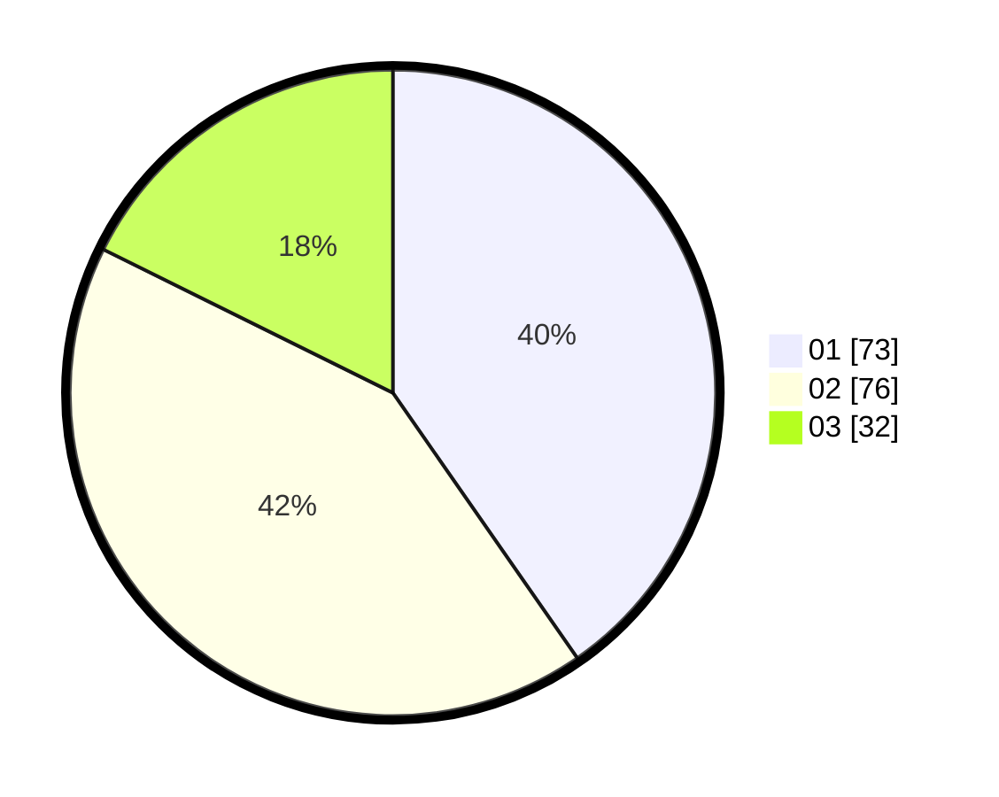

# Hasil

Hasil perolehan suara paslon dapat dilihat pada file paslon-01.txt, paslon-02.txt, dan paslon-03.txt.

Jika tidak ada, artinya data tersebut belum ada pada SIREKAP.

## Perolehan Suara

 * Paslon 01: **73**.
 * Paslon 02: **76**.
 * Paslon 03: **32**.

## Foto C Plano

https://sirekap-obj-formc.kpu.go.id/e360/pemilu/ppwp/31/71/08/10/04/3171081004021-20240215-003352--cead5a9e-eda4-4d0f-9539-fbc52ffc6a66.jpg

https://sirekap-obj-formc.kpu.go.id/e360/pemilu/ppwp/31/71/08/10/04/3171081004021-20240215-003512--be211128-4e75-44f7-af51-3296a84bbd2a.jpg

https://sirekap-obj-formc.kpu.go.id/e360/pemilu/ppwp/31/71/08/10/04/3171081004021-20240215-003613--1efb1d7d-9cf5-46a0-b975-24a068d1eaf8.jpg

## DATA PEMILIH TETAP

Jumlah pemilih dalam DPT: **263**.
 * L: **139**.
 * P: **124**.

## DATA PENGGUNA HAK PILIH

Jumlah pengguna hak pilih dalam DPT: **188**.
 * L: **94**.
 * P: **94**.

Jumlah pengguna hak pilih dalam DPTb: **1**.
 * L: **0**.
 * P: **1**.

Jumlah pengguna hak pilih dalam DPK: **1**.
 * L: **1**.
 * P: **0**.

Jumlah pengguna hak pilih: **190**.
 * L: **95**.
 * P: **95**.

## JUMLAH SUARA SAH DAN TIDAK SAH

JUMLAH SELURUH SUARA SAH: **181**.

JUMLAH SUARA TIDAK SAH: **9**.

JUMLAH SELURUH SUARA SAH DAN SUARA TIDAK SAH: **190**.
