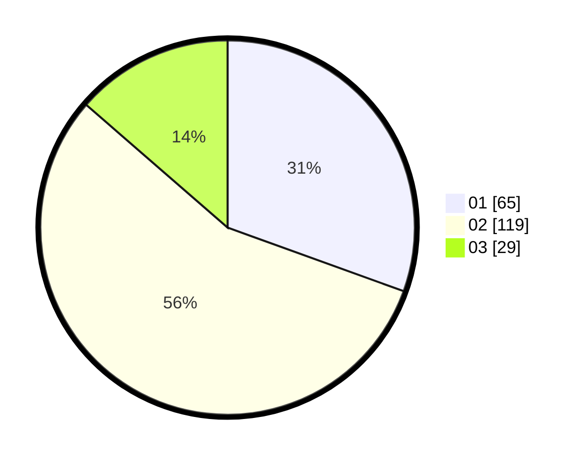

# Hasil

Hasil perolehan suara paslon dapat dilihat pada file paslon-01.txt, paslon-02.txt, dan paslon-03.txt.

Jika tidak ada, artinya data tersebut belum ada pada SIREKAP.

## Perolehan Suara

 * Paslon 01: **65**.
 * Paslon 02: **119**.
 * Paslon 03: **29**.

## Foto C Plano

https://sirekap-obj-formc.kpu.go.id/b4ec/pemilu/ppwp/31/71/08/10/04/3171081004023-20240219-135531--8b66b043-5de1-43ac-9109-90c316baa32f.jpg

https://sirekap-obj-formc.kpu.go.id/b4ec/pemilu/ppwp/31/71/08/10/04/3171081004023-20240216-115308--2c5afdf9-d877-4d3b-af42-6321f3d325c9.jpg

https://sirekap-obj-formc.kpu.go.id/b4ec/pemilu/ppwp/31/71/08/10/04/3171081004023-20240216-120251--91cd4d79-ddd7-4fb8-a6ac-487ed26c1588.jpg
