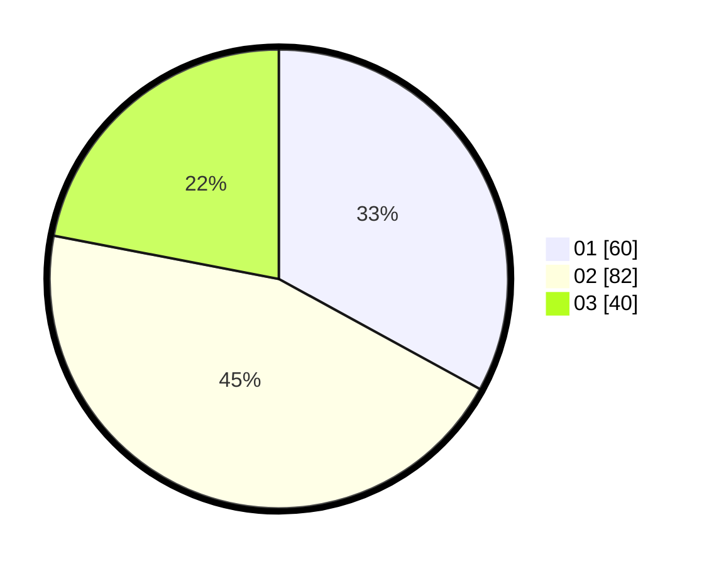

# Hasil

Hasil perolehan suara paslon dapat dilihat pada file paslon-01.txt, paslon-02.txt, dan paslon-03.txt.

Jika tidak ada, artinya data tersebut belum ada pada SIREKAP.

## Perolehan Suara

 * Paslon 01: **60**.
 * Paslon 02: **82**.
 * Paslon 03: **40**.

## Foto C Plano

https://sirekap-obj-formc.kpu.go.id/6283/pemilu/ppwp/31/71/08/10/04/3171081004024-20240214-155513--395563a7-f947-4618-9dcd-75b032e9bb8f.jpg

https://sirekap-obj-formc.kpu.go.id/6283/pemilu/ppwp/31/71/08/10/04/3171081004024-20240214-155441--3c65cac4-78dd-40fe-9b2e-a3b5ce12bf70.jpg

https://sirekap-obj-formc.kpu.go.id/6283/pemilu/ppwp/31/71/08/10/04/3171081004024-20240214-155858--bfdb815d-4e6d-4432-b655-9e08ac6c4252.jpg

## DATA PEMILIH TETAP

Jumlah pemilih dalam DPT: **263**.
 * L: **143**.
 * P: **120**.

## DATA PENGGUNA HAK PILIH

Jumlah pengguna hak pilih dalam DPT: **182**.
 * L: **92**.
 * P: **90**.

Jumlah pengguna hak pilih dalam DPTb: **0**.
 * L: **0**.
 * P: **0**.

Jumlah pengguna hak pilih dalam DPK: **5**.
 * L: **2**.
 * P: **3**.

Jumlah pengguna hak pilih: **187**.
 * L: **94**.
 * P: **93**.

## JUMLAH SUARA SAH DAN TIDAK SAH

JUMLAH SELURUH SUARA SAH: **182**.

JUMLAH SUARA TIDAK SAH: **5**.

JUMLAH SELURUH SUARA SAH DAN SUARA TIDAK SAH: **187**.
