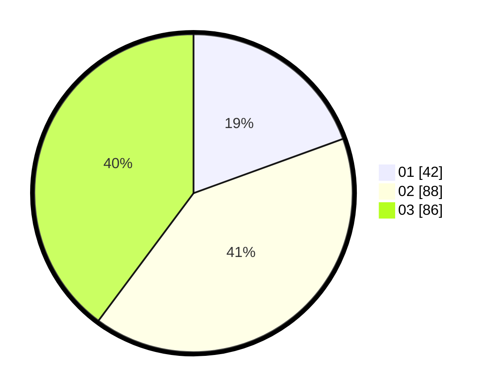

# Hasil

Hasil perolehan suara paslon dapat dilihat pada file paslon-01.txt, paslon-02.txt, dan paslon-03.txt.

Jika tidak ada, artinya data tersebut belum ada pada SIREKAP.

## Perolehan Suara

 * Paslon 01: **42**.
 * Paslon 02: **88**.
 * Paslon 03: **86**.

## Foto C Plano

https://sirekap-obj-formc.kpu.go.id/4f7b/pemilu/ppwp/31/71/08/10/04/3171081004026-20240217-172447--928d0e74-c8f9-4ce6-9021-c60ccfb204ba.jpg

https://sirekap-obj-formc.kpu.go.id/4f7b/pemilu/ppwp/31/71/08/10/04/3171081004026-20240217-172448--f9d40895-7905-4dc0-8c75-6777cee80b07.jpg

https://sirekap-obj-formc.kpu.go.id/4f7b/pemilu/ppwp/31/71/08/10/04/3171081004026-20240217-172447--366e58d6-ca23-4040-a88c-e881a4fde883.jpg

## DATA PEMILIH TETAP

Jumlah pemilih dalam DPT: **254**.
 * L: **135**.
 * P: **119**.

## DATA PENGGUNA HAK PILIH

Jumlah pengguna hak pilih dalam DPT: **214**.
 * L: **115**.
 * P: **99**.

Jumlah pengguna hak pilih dalam DPTb: **0**.
 * L: **0**.
 * P: **0**.

Jumlah pengguna hak pilih dalam DPK: **3**.
 * L: **1**.
 * P: **2**.

Jumlah pengguna hak pilih: **217**.
 * L: **116**.
 * P: **101**.

## JUMLAH SUARA SAH DAN TIDAK SAH

JUMLAH SELURUH SUARA SAH: **216**.

JUMLAH SUARA TIDAK SAH: **1**.

JUMLAH SELURUH SUARA SAH DAN SUARA TIDAK SAH: **217**.
