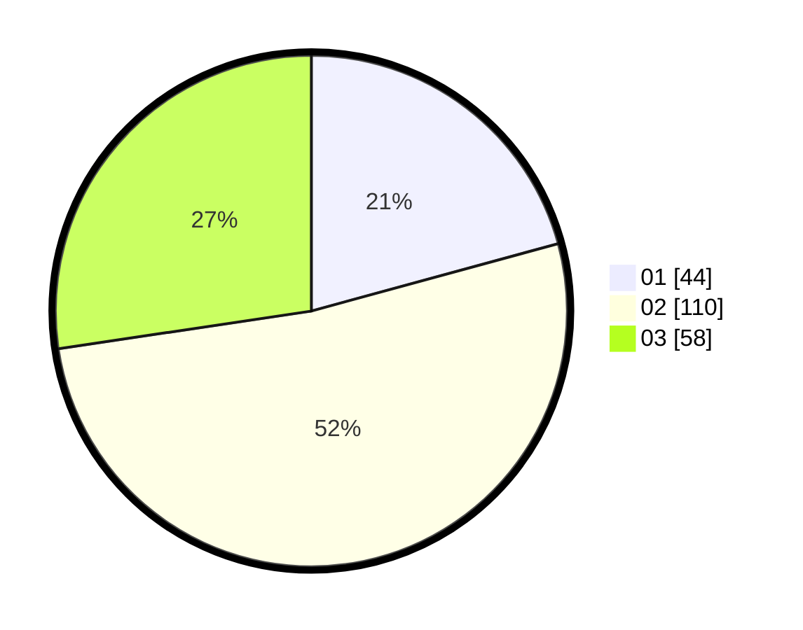

# Hasil

Hasil perolehan suara paslon dapat dilihat pada file paslon-01.txt, paslon-02.txt, dan paslon-03.txt.

Jika tidak ada, artinya data tersebut belum ada pada SIREKAP.

## Perolehan Suara

 * Paslon 01: **44**.
 * Paslon 02: **110**.
 * Paslon 03: **58**.

## Foto C Plano

https://sirekap-obj-formc.kpu.go.id/0c0d/pemilu/ppwp/31/71/08/10/04/3171081004030-20240216-213754--325d629b-8515-4e5a-bd98-5a413dc9ad89.jpg

https://sirekap-obj-formc.kpu.go.id/0c0d/pemilu/ppwp/31/71/08/10/04/3171081004030-20240216-213755--80854f66-f8f1-4968-839a-16d7d7f978d8.jpg

https://sirekap-obj-formc.kpu.go.id/0c0d/pemilu/ppwp/31/71/08/10/04/3171081004030-20240216-213755--ab45bee4-bd26-4446-b9a4-05036057fae6.jpg

## DATA PEMILIH TETAP

Jumlah pemilih dalam DPT: **275**.
 * L: **139**.
 * P: **136**.

## DATA PENGGUNA HAK PILIH

Jumlah pengguna hak pilih dalam DPT: **215**.
 * L: **105**.
 * P: **110**.

Jumlah pengguna hak pilih dalam DPTb: **0**.
 * L: **0**.
 * P: **0**.

Jumlah pengguna hak pilih dalam DPK: **0**.
 * L: **0**.
 * P: **0**.

Jumlah pengguna hak pilih: **215**.
 * L: **105**.
 * P: **110**.

## JUMLAH SUARA SAH DAN TIDAK SAH

JUMLAH SELURUH SUARA SAH: **212**.

JUMLAH SUARA TIDAK SAH: **3**.

JUMLAH SELURUH SUARA SAH DAN SUARA TIDAK SAH: **215**.
