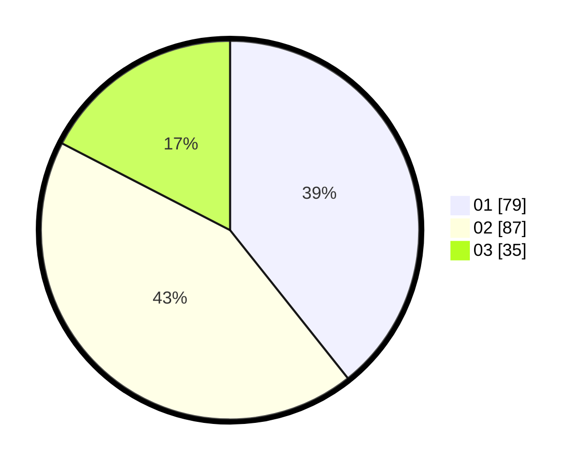

# Hasil

Hasil perolehan suara paslon dapat dilihat pada file paslon-01.txt, paslon-02.txt, dan paslon-03.txt.

Jika tidak ada, artinya data tersebut belum ada pada SIREKAP.

## Perolehan Suara

 * Paslon 01: **79**.
 * Paslon 02: **87**.
 * Paslon 03: **35**.

## Foto C Plano

https://sirekap-obj-formc.kpu.go.id/afa1/pemilu/ppwp/31/71/08/10/04/3171081004033-20240216-061616--e2b13fbd-bb6c-4b83-a3c4-58402023c630.jpg

https://sirekap-obj-formc.kpu.go.id/afa1/pemilu/ppwp/31/71/08/10/04/3171081004033-20240216-061618--e45b7618-eca0-48f8-af1c-582c6fe0356a.jpg

https://sirekap-obj-formc.kpu.go.id/afa1/pemilu/ppwp/31/71/08/10/04/3171081004033-20240216-061617--0a513e0c-630a-4d94-a0b7-4bbaae9d35c7.jpg

## DATA PEMILIH TETAP

Jumlah pemilih dalam DPT: **284**.
 * L: **141**.
 * P: **143**.

## DATA PENGGUNA HAK PILIH

Jumlah pengguna hak pilih dalam DPT: **201**.
 * L: **93**.
 * P: **108**.

Jumlah pengguna hak pilih dalam DPTb: **0**.
 * L: **0**.
 * P: **0**.

Jumlah pengguna hak pilih dalam DPK: **1**.
 * L: **1**.
 * P: **0**.

Jumlah pengguna hak pilih: **202**.
 * L: **94**.
 * P: **108**.

## JUMLAH SUARA SAH DAN TIDAK SAH

JUMLAH SELURUH SUARA SAH: **201**.

JUMLAH SUARA TIDAK SAH: **1**.

JUMLAH SELURUH SUARA SAH DAN SUARA TIDAK SAH: **202**.
