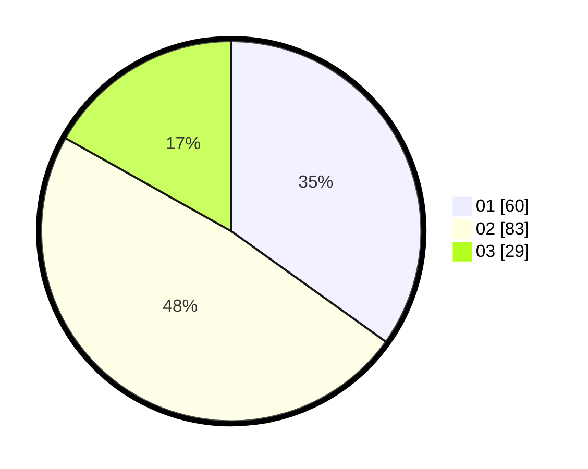

# Hasil

Hasil perolehan suara paslon dapat dilihat pada file paslon-01.txt, paslon-02.txt, dan paslon-03.txt.

Jika tidak ada, artinya data tersebut belum ada pada SIREKAP.

## Perolehan Suara

 * Paslon 01: **60**.
 * Paslon 02: **83**.
 * Paslon 03: **29**.

## Foto C Plano

https://sirekap-obj-formc.kpu.go.id/a502/pemilu/ppwp/31/71/08/10/04/3171081004035-20240217-164317--4bdd36ec-ac20-47bd-bf3d-154b90d472a6.jpg

https://sirekap-obj-formc.kpu.go.id/a502/pemilu/ppwp/31/71/08/10/04/3171081004035-20240217-164319--4f297668-fda9-47ff-9c0e-58b915327f3a.jpg

https://sirekap-obj-formc.kpu.go.id/a502/pemilu/ppwp/31/71/08/10/04/3171081004035-20240217-164318--0e620f4f-6c12-4fd1-9ad8-31b6acb86fd1.jpg

## DATA PEMILIH TETAP

Jumlah pemilih dalam DPT: **257**.
 * L: **131**.
 * P: **126**.

## DATA PENGGUNA HAK PILIH

Jumlah pengguna hak pilih dalam DPT: **173**.
 * L: **90**.
 * P: **83**.

Jumlah pengguna hak pilih dalam DPTb: **0**.
 * L: **0**.
 * P: **0**.

Jumlah pengguna hak pilih dalam DPK: **3**.
 * L: **1**.
 * P: **2**.

Jumlah pengguna hak pilih: **176**.
 * L: **91**.
 * P: **85**.

## JUMLAH SUARA SAH DAN TIDAK SAH

JUMLAH SELURUH SUARA SAH: **172**.

JUMLAH SUARA TIDAK SAH: **4**.

JUMLAH SELURUH SUARA SAH DAN SUARA TIDAK SAH: **176**.
